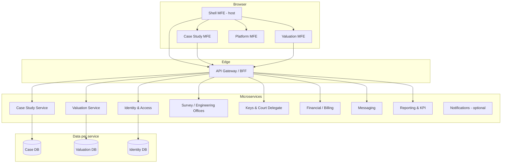
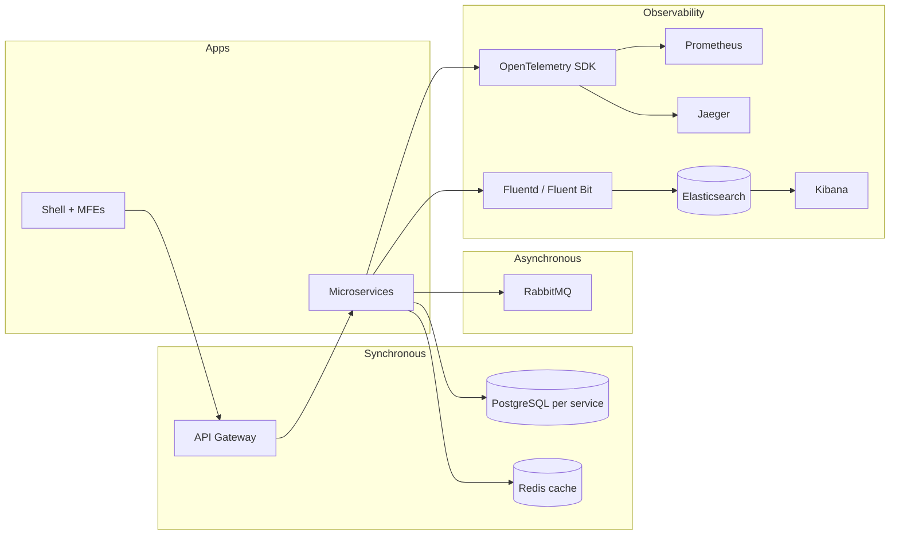

# Architecture roadmap: microfrontends + microservices

This document defines **what to implement** when evolving the Real Estate Evaluation platform from the current **monolithic Next.js shell + single ASP.NET API** into a **microfrontend (MFE) web platform** backed by **domain microservices**.

It is grounded in:

- Current UI routes (`dashboard`, `po`, `properties`, `assignment`, `survey`, `keys`, `failures`, `valuation-requests`, `field-form`, `messages`, `financial`, `kpi`, `users`)
- Current backend: **YARP gateway** (`backend/gateway`) + **domain services** under `backend/services/` (Identity, Case Study, Operations, Reporting, Financial, Valuation). Legacy monolith `RealEstateEval.Api` removed.
- Reference prototype: `requirment/system_prototype_4.html`

---

## 1. Current state (baseline)

| Layer | Today | Gap |
|--------|--------|-----|
| **Frontend** | Monorepo: `apps/shell` (host) + `packages/*` (design-system, auth-client, api-client, types); pages under `apps/shell/src/app/(app)/[page]`; mock data in `constants.ts` | No federated remotes yet; no independent MFE deploys |
| **Backend** | One API project; `AuthController` + PostgreSQL Identity | No domain services; no API gateway; no async integration |
| **Auth** | JWT in `sessionStorage`; prototype role switcher separate from API roles | No centralized policy across MFEs/services |
| **Data** | `MOCK_*` arrays | No service-owned databases |

**Principle:** Do not rewrite everything at once. Extract by **bounded context** (case study vs valuation vs platform) in parallel on backend and frontend.

---

## 2. Target architecture (high level)



---

## 3. Microfrontend design (frontend)

### 3.1 Recommended approach

For this stack, prefer **Module Federation** (e.g. `@module-federation/nextjs-mf` or Webpack 5 federation) with a **shell (host)** application:

| Option | When to use |
|--------|-------------|
| **Module Federation + Next.js shell** | Best fit: independent teams, separate deploys, shared React runtime |
| **Monorepo packages only** (Turborepo/pnpm workspaces, no federation) | Smaller team; single deploy; “logical” MFEs first, physical split later |
| **iframe-based MFEs** | Avoid unless legacy constraints; worse UX and auth sharing |

**Recommendation:** Start with a **monorepo** (`apps/` + `packages/`), introduce **Module Federation** when two domains need **independent release cadence**.

### 3.2 Proposed MFE map (aligned to nav)

| MFE | Routes / features | Owns (UI) | Consumes APIs |
|-----|-------------------|-----------|----------------|
| **shell** | Login, logout, layout, sidebar, topbar, role-aware nav, breadcrumbs, design tokens | `@platform/shell`, `@platform/auth-client` | Identity (auth), optional “nav permissions” |
| **case-study** | `dashboard` (case KPIs), `po`, `properties`, `assignment`, `failures`, property/PO detail | `@case-study/*` | Case Study, Assignment (or part of Case), Failures |
| **valuation** | `valuation-requests`, `field-form`, valuer workflows | `@valuation/*` | Valuation, Field inspection |
| **operations** | `survey`, `keys` | `@operations/*` | Survey offices, Keys |
| **platform** | `users`, `messages`, `kpi` | `@platform/admin` | Identity/Users, Messaging, KPI aggregate |
| **financial** | `financial` | `@financial/*` | Financial / billing |

**Shared packages (not MFEs):**

- `@platform/design-system` — CSS variables, `prototype.css` tokens, buttons, tables, badges
- `@platform/api-client` — typed HTTP client, auth header injection, error handling
- `@platform/types` — DTOs shared with OpenAPI-generated clients
- `@platform/i18n` — Arabic RTL helpers if needed later

### 3.3 Shell responsibilities (must implement)

- [ ] **Authentication gate** (replace ad-hoc `sessionStorage` checks with shared `@platform/auth-client`)
- [ ] **Load remote MFEs** by route (dynamic `import()` of federated modules)
- [ ] **Single sign-on session**: access token refresh, logout clearing all MFE local state
- [ ] **Navigation contract**: shell passes `user`, `permissions`, `locale`, `apiBaseUrl` to remotes via props or shared context adapter
- [ ] **Error boundary** per remote so one failed MFE does not blank the shell
- [ ] **Version compatibility matrix** (shell React/Next version pins remotes)

### 3.4 Per-MFE implementation checklist

For **each** remote MFE:

- [ ] Standalone dev server (can run without shell for local work)
- [ ] Exposes `pages` or route manifest consumed by shell
- [ ] Uses **only** its service APIs (no direct calls to another service’s DB)
- [ ] Owns feature components currently in `src/components/prototype/*` for that domain
- [ ] Replaces `MOCK_*` with API hooks (React Query / SWR recommended)
- [ ] E2E smoke test: shell loads remote route

### 3.5 Frontend folder structure (target)

```text
/
├── apps/
│   ├── shell/                 # Host: login, AppShell, federation config
│   ├── mfe-case-study/
│   ├── mfe-valuation/
│   ├── mfe-operations/
│   ├── mfe-financial/
│   └── mfe-platform/
├── packages/
│   ├── design-system/
│   ├── api-client/
│   ├── auth-client/
│   └── types/
└── requirment/                # unchanged reference
```

### 3.6 Migration from current repo (phased)

| Phase | Action |
|-------|--------|
| **F0** | Create `apps/shell` + `packages/*`; move existing `src/` into `apps/shell` or keep root as shell temporarily |
| **F1** | Extract `design-system` + `api-client`; wire one page (e.g. `properties`) to real API |
| **F2** | Split **valuation** MFE first (clear boundary vs case study in prototype) |
| **F3** | Split **case-study** MFE (largest: PO, properties, assignment, failures) |
| **F4** | Split **operations**, **financial**, **platform** |
| **F5** | Module Federation in CI/CD; independent deploy URLs per MFE |

---

## 4. Microservices design (backend)

### 4.1 Service boundaries (bounded contexts)

| Service | Responsibility | Core aggregates | DB |
|---------|----------------|-----------------|-----|
| **Identity & Access** | Users, roles, JWT, permissions | User, Role, Permission | `identity_db` |
| **Case Study** | PO intake, properties, case workflow, specialists, study forms | PurchaseOrder, Property, CaseStudy | `case_db` |
| **Assignment** | Workload distribution, team capacity (can merge into Case Study initially) | Assignment, WorkloadSnapshot | `case_db` or own |
| **Failures** | Impediments, review/approve workflow | Failure, FailureEvent | `case_db` or own |
| **Valuation** | VR requests from case study, appraiser assignment, reports | ValuationRequest, ValuationReport | `valuation_db` |
| **Field Inspection** | Inspector mobile form, photos, draft/submit | FieldInspection, Attachment | `valuation_db` or own |
| **Survey** | Engineering offices, survey jobs | SurveyOffice, SurveyJob | `operations_db` |
| **Keys** | Court keys, delegate actions | KeyRequest, KeyReceipt | `operations_db` |
| **Financial** | Revenue/cost per PO, provider invoices | Invoice, CostLine, POBilling | `financial_db` |
| **Messaging** | Internal messages (or integrate external later) | Thread, Message | `messaging_db` |
| **Reporting / KPI** | Read-only aggregates, dashboards | (materialized views / CQRS) | `reporting_db` |

**Start smaller:** merge **Assignment** + **Failures** into **Case Study**; merge **Field Inspection** into **Valuation** until traffic justifies split.

### 4.2 API style per service

- [ ] **REST** with OpenAPI 3 per service (`/swagger` or `/openapi/v1.json`)
- [ ] **Versioning**: `/api/v1/...`
- [ ] **Idempotency** on commands that external systems retry (PO intake, key receipt)
- [ ] **Pagination** on all list endpoints (`page`, `pageSize`, `total`)
- [ ] **Problem Details** (`application/problem+json`) for errors

### 4.3 Cross-service rules

| Rule | Implementation |
|------|----------------|
| **No shared database** | Each service owns its schema; integrate via APIs or events |
| **No distributed transactions** | Use **sagas** or **outbox + events** for multi-step flows |
| **Reference by ID** | Case Study holds `propertyId`; Valuation holds `valuationRequestId` + `propertyId` copy for queries |
| **AuthZ at gateway and service** | JWT validated at gateway; service checks claims/policies again |

### 4.4 Key integration flows (implement as contracts)

1. **PO received (Case Study)** → properties created → event `PropertyCreated`
2. **Case Study requests valuation** → command to Valuation → `ValuationRequestCreated`
3. **Valuation completes** → event `ValuationReportSubmitted` → Case Study updates property `val` stage
4. **Survey assigned** → Survey service updates job status → Case Study reads status via API or event
5. **Failure approved** → Case Study updates property status; may block valuation

Define these as **async integration events** (see section 4.6).

### 4.5 Per-service technical checklist (.NET)

For each microservice repository (or `backend/services/<name>/`):

- [ ] ASP.NET Core minimal API or controllers
- [ ] Own PostgreSQL database + EF Core migrations
- [ ] Health: `GET /health`, `GET /ready`
- [ ] Structured logging (correlation id from gateway)
- [ ] Docker image + `Dockerfile`
- [ ] Configuration via env vars + `appsettings`
- [ ] Integration tests with Testcontainers (Postgres)
- [ ] Contract tests (Pact or OpenAPI diff) for consumers

Migrate existing Identity code into **Identity & Access** service (**done**); monolith API retired.

### 4.6 Messaging & consistency (implement when 2+ services exist)

- [ ] **Message broker**: RabbitMQ or Azure Service Bus (or Kafka if scale requires)
- [ ] **Outbox pattern** in each service DB for reliable publish
- [ ] **Event catalog** (versioned JSON schemas), e.g.:
  - `case.property.created.v1`
  - `valuation.request.created.v1`
  - `valuation.report.submitted.v1`
  - `failure.approved.v1`
- [ ] **Idempotent consumers** (dedupe by `eventId`)

### 4.7 API Gateway / BFF

Implement **one** entry point for the browser:

| Component | Responsibility |
|-----------|----------------|
| **API Gateway** (YARP, Ocelot, or cloud APIM) | TLS, JWT validation, rate limit, route `/api/case/*` → Case Study, `/api/val/*` → Valuation |
| **Optional BFF** (`apps/bff` or gateway aggregation) | Compose dashboard KPIs from multiple services in one round-trip |

- [ ] Route table documented in repo
- [ ] CORS aligned with shell + MFE origins
- [ ] Propagate `Authorization` and `X-Correlation-Id`

### 4.8 Backend folder structure (target)

```text
backend/
├── gateway/                   # YARP or Ocelot
├── services/
│   ├── identity/
│   ├── case-study/
│   ├── valuation/
│   ├── operations/            # survey + keys
│   ├── financial/
│   ├── messaging/
│   └── reporting/
├── shared/
│   ├── BuildingBlocks/        # optional: common auth, outbox, swagger
│   └── Contracts/             # event DTOs (NuGet or shared project)
└── docker-compose.yml         # local: postgres instances, rabbitmq, all services
```

---

## 5. Security & roles (cross-cutting)

Map prototype roles to **permissions** (implement in Identity service):

| Prototype role | Example permissions |
|----------------|---------------------|
| `general-manager` | read:all, approve:failure |
| `section-supervisor` | read:case, approve:failure, assign:case |
| `operations-coordinator` | write:po, write:assignment |
| `case-specialist` | write:property, write:failure |
| `valuation-coordinator` | write:valuation-request, assign:appraiser |
| `real-estate-appraiser` | write:valuation-report |
| `field-inspector` | write:field-form |
| `court-delegate` | write:keys |
| `financial-officer` | read:financial |

- [ ] JWT claims: `sub`, `email`, `roles[]` or `permissions[]`
- [ ] Shell builds nav from **permissions**, not hardcoded `ROLES[role].pages` only
- [ ] Each microservice enforces policies on endpoints

---

## 6. Observability & DevOps (implement early)

- [ ] **Correlation ID** end-to-end (shell → gateway → services)
- [ ] **OpenTelemetry** traces + metrics in each service
- [ ] **Centralized logs** (see section 6.1 — Fluentd + Elasticsearch + Kibana, or Seq for local dev)
- [ ] CI: build + test each service and MFE independently
- [ ] CD: deploy shell + remotes + gateway with compatible versions
- [ ] Feature flags for gradual MFE rollout (optional)

---

## 6.1 Platform stack: Elasticsearch, Fluentd, Kibana, Jaeger, Prometheus, Redis, RabbitMQ, Cassandra

This section maps each technology to **role**, **when you need it**, and **how it fits** the Real Estate Evaluation microservices + MFE design.

### At-a-glance

| Technology | Primary role | Need for this project? | Typical pairing |
|------------|--------------|------------------------|-----------------|
| **PostgreSQL** | System of record per service (OLTP) | **Yes — already chosen** | EF Core, each microservice DB |
| **RabbitMQ** | Async integration between services | **Yes — when 2+ services** | Outbox, domain events |
| **Redis** | Cache, locks, rate limits, optional pub/sub | **Yes — soon after APIs** | Hot reads, dashboard, sessions |
| **Prometheus** | Metrics (CPU, latency, error rates) | **Yes — with microservices** | Grafana dashboards, Alertmanager |
| **Jaeger** | Distributed tracing (request path across services) | **Yes — with microservices** | OpenTelemetry SDK in .NET / Next |
| **Fluentd** | Collect & forward logs from containers/hosts | **Yes — in K8s / multi-container** | Elasticsearch or cloud log sink |
| **Elasticsearch** | Log storage + full-text search | **Logs: yes at scale; search: optional** | Kibana, or app search index |
| **Kibana** | Explore logs & build dashboards on ES data | **Yes — if you use Elasticsearch for logs** | Not for app metrics (use Grafana) |
| **Cassandra** | Massive-scale append-only / wide-column store | **No for MVP** | Only if audit/events exceed Postgres |



---

### RabbitMQ — message broker (async microservices)

**What it does:** Services publish **events** (e.g. `valuation.report.submitted`) without calling each other synchronously. Consumers process messages reliably with retries and dead-letter queues.

**Where it fits:**

- Case Study creates a property → publishes `PropertyCreated` → Valuation service creates a pending VR.
- Valuation submits report → Case Study updates property workflow stage.
- Failure approved → notify Case Study + optional notification service.

**Implement:**

- [ ] One **virtual host** per environment (`dev`, `staging`, `prod`)
- [ ] **Exchanges**: topic (`case.*`, `valuation.*`) or dedicated exchanges per bounded context
- [ ] **Outbox table** in each service DB + background publisher (never publish in the same request without outbox)
- [ ] **Idempotent consumers** (`eventId` dedupe)
- [ ] Dead-letter queue + alerting when DLQ depth > 0

**When:** Phase B (first cross-service flow). Not required while everything is one monolith API.

**Alternative:** Azure Service Bus, AWS SQS — same pattern; RabbitMQ is common for on-prem / Docker Compose local dev.

---

### Redis — cache & fast ephemeral state

**What it does:** In-memory store for **low-latency** reads, not your source of truth.

**Where it fits:**

| Use case | Example in this platform |
|----------|---------------------------|
| **Read-through cache** | Dashboard KPIs, workload bars, property list filters |
| **Distributed lock** | Prevent double-assignment of the same property to two specialists |
| **Rate limiting** | API gateway or Identity login throttling |
| **Session / refresh token blocklist** | Optional: revoke JWT before expiry |
| **Pub/Sub** | Real-time UI updates (optional; RabbitMQ is better for domain events) |

**Implement:**

- [ ] Cache keys with TTL: `case:property:{id}`, `reporting:dashboard:{role}`
- [ ] Invalidate on write (or short TTL + event-driven eviction)
- [ ] Redis **not** shared as a database between services — each service uses its own key prefix or logical DB index

**When:** Phase A–B when Case Study API goes live and dashboard hits multiple aggregates.

**Do not:** Store authoritative PO/property data only in Redis.

---

### Prometheus — metrics

**What it does:** Scrapes **numeric time series**: request rate, latency histograms, error counts, CPU, queue depth.

**Where it fits:**

- API Gateway: requests per route, 5xx rate
- Each microservice: `http_server_request_duration_seconds`, custom counters (`properties_created_total`)
- RabbitMQ exporter: queue length, consumer lag
- Redis exporter: memory, evictions

**Implement:**

- [ ] Expose `/metrics` (Prometheus format) on each service or use OpenTelemetry → Prometheus exporter
- [ ] **Grafana** dashboards (Prometheus is storage; **Kibana is not** the standard metrics UI)
- [ ] **Alertmanager**: alert on error rate, p95 latency, disk, broker DLQ

**When:** As soon as the second service runs in staging.

---

### Jaeger (Uber) — distributed tracing

**What it does:** Shows one **trace** for a user action across shell → gateway → Case Study → RabbitMQ → Valuation (each hop is a **span**).

**Where it fits:**

- Debug slow “save property” flows
- Prove gateway routing and correlation IDs work
- Find which downstream call failed in a saga

**Implement:**

- [ ] Instrument with **OpenTelemetry** (.NET `OpenTelemetry.Instrumentation.AspNetCore`, browser optional)
- [ ] Propagate **W3C trace context** (`traceparent` header) from MFE → gateway → all services
- [ ] Export traces to **Jaeger** backend (or Grafana Tempo, Zipkin — same model)
- [ ] Link traces to logs via **trace ID** in every log line

**When:** Phase B with multiple services. Jaeger is the **trace backend**; you do not pick “Jaeger OR OpenTelemetry” — you use OTel SDK + Jaeger as one exporter.

---

### Fluentd — log shipping

**What it does:** **Agent** on each node/container that tails log files or receives structured logs, transforms them, forwards to a central store (Elasticsearch, cloud logging, etc.).

**Where it fits:**

- Kubernetes: DaemonSet collects all pod stdout
- Docker Compose: Fluent Bit sidecar per service
- Normalizes .NET JSON logs + nginx/gateway access logs into one pipeline

**Implement:**

- [ ] Structured logging in .NET (`Serilog` → JSON with `traceId`, `service`, `correlationId`)
- [ ] Fluentd / **Fluent Bit** config: parse JSON, add k8s metadata, ship to Elasticsearch
- [ ] Avoid logging PII/passwords; scrub tokens

**When:** Staging/production with more than one container. For local dev, **Seq** or console is enough.

**Note:** **Logstash** is the Elastic alternative to Fluentd; pick **one** collector family (Fluent Bit is lighter).

---

### Elasticsearch — search & log storage

**What it does:** Two different jobs:

1. **Centralized log index** (with Fluentd → ES → Kibana) — primary ops use case early.
2. **Application search** — full-text search on properties, PO numbers, specialist names, failure text.

**Where it fits:**

| Job | Example |
|-----|---------|
| **Logs** | “Show all errors for `propertyId=E-4402` in the last hour” |
| **App search** | Properties table: search by area, PO id, specialist (faster than heavy SQL `LIKE`) |
| **KPI / analytics** | Optional: aggregate dashboards (often better served by Reporting service + Postgres or OLAP) |

**Implement:**

- [ ] Log index: daily indices `logs-{yyyy.MM.dd}`, retention policy (e.g. 30 days)
- [ ] Search index (optional): `properties` index synced from Case Study via events or CDC
- [ ] Do **not** replace PostgreSQL as system of record with Elasticsearch

**When:**

- Logs: production or serious staging.
- App search: when property volume and filter UX require it (hundreds of thousands+ rows or complex text search).

---

### Kibana — visualize Elasticsearch data

**What it does:** UI to search logs, build dashboards, create alerts on log patterns.

**Where it fits:**

- Ops: “500 errors on Case Study service”
- Support: trace one PO through all log lines using `correlationId`
- **Not** used for Prometheus metrics — use **Grafana** for metrics + often for traces (Tempo) too

**Implement:**

- [ ] Index patterns for `logs-*`
- [ ] Saved searches per service (`service:case-study`)
- [ ] Dashboards: error rate from logs, slow requests (if logged)

**When:** Same time as Elasticsearch for logs (ELK = Elasticsearch + Logstash/Fluentd + Kibana).

---

### Cassandra — wide-column database (usually skip for MVP)

**What it does:** Horizontally scalable, write-optimized store for **very large** append-only or time-series workloads.

**Where it might fit (later, not now):**

- Billions of audit events with TTL
- Global multi-datacenter write-heavy telemetry you own
- Message history at chat scale

**Why not for this project initially:**

- Transactional domains (PO, property, valuation, billing) fit **PostgreSQL** + clear boundaries.
- Team already on EF Core + Postgres; Cassandra adds ops complexity (tuning, consistency model, no joins).

**Implement only if:**

- [ ] Postgres + partitioning cannot meet write volume, **and**
- [ ] You have a dedicated use case (audit log, IoT-style events), **not** “because microservices need Cassandra”

**Default:** Use Postgres per service; optional **event store** table or RabbitMQ + Reporting read models before Cassandra.

---

### Recommended stacks by maturity

| Stage | Messaging | Cache | Metrics | Traces | Logs |
|-------|-----------|-------|---------|--------|------|
| **Now (monolith)** | — | — | optional local Prometheus | optional | console / Seq |
| **Phase A–B (2–3 services)** | RabbitMQ | Redis | Prometheus + Grafana | Jaeger + OpenTelemetry | Fluent Bit → ES → Kibana **or** cloud equivalent |
| **Scale / compliance** | RabbitMQ cluster | Redis cluster | HA Prometheus | Jaeger / Tempo HA | ES cluster + ILM retention |

### Local developer stack

**Implemented:** `infra/docker-compose.yml` — run with:

```bash
docker compose -f infra/docker-compose.yml up -d
```

See **[LOCAL_INFRA.md](./LOCAL_INFRA.md)** for URLs, credentials, and how to connect the API.

---

### What to implement first (priority order)

1. **PostgreSQL** — keep as source of truth per service (already started).
2. **RabbitMQ** — when Valuation ↔ Case Study events exist.
3. **Redis** — cache dashboard + hot property reads.
4. **OpenTelemetry + Jaeger + Prometheus + Grafana** — one observability pass when gateway + 2 services deploy.
5. **Fluentd/Fluent Bit + Elasticsearch + Kibana** — centralized logs in staging/prod.
6. **Elasticsearch app search index** — only if product needs advanced property/PO search.
7. **Cassandra** — defer unless a clear high-volume append-only requirement appears.

---

## 7. Implementation phases (recommended order)

### Phase A — Foundation (2–4 weeks)

**Backend**

- [ ] Add `backend/gateway` routing to existing API (temporary monolith behind gateway)
- [ ] OpenAPI for Identity; document auth flows
- [ ] Introduce `case-study` service skeleton + `Property`/`PO` read APIs backed by Postgres (migrate off mocks)

**Frontend**

- [ ] Monorepo: `packages/design-system`, `packages/api-client`
- [ ] Properties list + detail calling Case Study API
- [ ] Keep single deploy; no federation yet

### Phase B — First split (4–6 weeks)

**Backend**

- [ ] **Valuation** service: CRUD valuation requests, link to `propertyId`
- [ ] Event: `ValuationReportSubmitted` → Case Study consumer updates workflow stage

**Frontend**

- [ ] `apps/mfe-valuation` remote + shell route integration
- [ ] Valuation pages use Valuation API only

### Phase C — Case study MFE (4–6 weeks)

**Backend**

- [ ] Case Study: PO, assignment, failures APIs
- [ ] Optional: separate Failure workflow service

**Frontend**

- [ ] `apps/mfe-case-study`: dashboard (case slice), PO, properties, assignment, failures
- [ ] Module Federation enabled in dev/staging

### Phase D — Operations, financial, platform (parallel)

- [ ] Survey, Keys, Financial, Messaging, KPI/reporting services (thin slices first)
- [ ] Matching MFEs or combined `mfe-operations` / `mfe-platform`

### Phase E — Hardening

- [ ] Saga/outbox for cross-service flows
- [ ] Contract tests, load tests on gateway
- [x] Decommission `RealEstateEval.Api` monolith
- [ ] Decommission frontend mock constants

---

## 8. API surface sketch (v1) — what to implement

### Identity (`/api/identity/v1`)

- `POST /auth/login`, `POST /auth/refresh`, `POST /auth/logout`
- `GET /users`, `POST /users`, `PATCH /users/{id}`
- `GET /me`, `GET /permissions`

### Case Study (`/api/case/v1`)

- `GET/POST /purchase-orders`, `GET /purchase-orders/{id}`
- `GET/POST /properties`, `GET/PATCH /properties/{id}`
- `GET /properties/{id}/timeline`
- `POST /assignments`, `GET /workload`
- `GET/POST /failures`, `PATCH /failures/{id}/status`

### Valuation (`/api/valuation/v1`)

- `GET/POST /requests`, `GET/PATCH /requests/{id}`
- `POST /requests/{id}/report`, `POST /requests/{id}/impediment`
- `GET/PUT /field-inspections/{propertyId}`

### Operations (`/api/operations/v1`)

- `GET/POST /survey-offices`, `GET/POST /survey-jobs`
- `GET /keys`, `POST /keys/{propertyId}/receive`

### Financial (`/api/financial/v1`)

- `GET /summary`, `GET /purchase-orders/{poId}/billing`

### Reporting (`/api/reporting/v1`)

- `GET /dashboard`, `GET /kpi/specialists`, `GET /kpi/providers`

*(Messaging can be v2 if not critical for MVP.)*

---

## 9. Decisions to record (ADR)

Before coding splits, document choices in `docs/adr/`:

1. **MFE technology**: Module Federation vs monorepo-only phase 1
2. **Broker**: RabbitMQ vs cloud-native bus
3. **Database per service**: strict from day 1 vs shared Postgres with schemas initially
4. **BFF**: yes/no for dashboard aggregation
5. **File storage**: blob service for field photos and documents (Azure Blob / S3)

---

## 10. Definition of done (architecture)

The migration is **architecturally complete** when:

- [ ] Shell is the only app users open; domain UIs are federated remotes
- [ ] Each domain service has its own DB, CI pipeline, and OpenAPI spec
- [ ] Gateway routes all browser traffic; no MFE calls another service’s DB
- [ ] Cross-domain workflows use events or documented sagas
- [ ] Prototype mock data removed; roles enforced via Identity
- [ ] `docker compose up` runs local full stack for developers

---

## 11. References in this repo

| Artifact | Path |
|----------|------|
| UI prototype | `requirment/system_prototype_4.html` |
| Shell app | `apps/shell/` |
| Current pages map | `apps/shell/src/app/(app)/[page]/page.tsx` |
| Nav / roles / mocks | `packages/app-shared/src/prototype/constants.ts` |
| Shared packages | `packages/design-system`, `packages/auth-client`, `packages/api-client`, `packages/types` |
| Current API | `backend/gateway/` + `backend/services/*/` |

---

*Last updated: planning document for microfrontend + microservices evolution. Adjust service names and phase dates with the team before implementation.*
