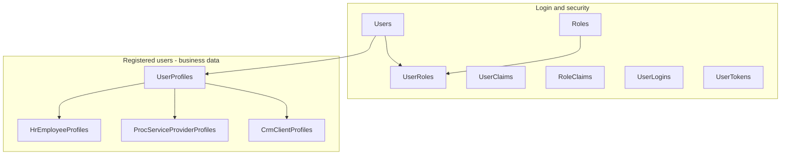

# Database overview (PostgreSQL)

> **نسخة HTML (عربي، للمشاركة / الطباعة):** افتح [DATABASE_OVERVIEW.html](./DATABASE_OVERVIEW.html) في المتصفح.

**Audience:** Project managers, stakeholders, and new developers  
**Project:** Ejada Internal — Real Estate Evaluation & Case Study Platform  
**Last updated:** May 2026  

---

## Executive summary

The application uses **PostgreSQL** as the system of record. **User management is implemented end-to-end** in the database and API: login, the three registration flows (employee, service provider, client), and the users list screen.

**All other product modules** (work orders, properties, valuation, financials, KPIs, etc.) are still **UI prototypes with mock data** — they do not have database tables yet.

| Area | Database status |
|------|-----------------|
| Login & roles | Implemented |
| User registration (HR / PROC / CRM) | Implemented |
| User list (إدارة المستخدمين) | Implemented |
| Edit / deactivate users | Not started |
| PO, properties, valuation, … | Not started |

---

## Connection (local development)

| Setting | Value |
|---------|--------|
| Host | `localhost` |
| Port | `5432` |
| Database | `realestate_eval_dev` |
| Username | `postgres` |
| Password | `Admin` (see `infra/docker-compose.yml`) |

Start Postgres: `docker compose -f infra/docker-compose.yml up -d postgres`  
Apply migrations: start Case Study once (`npm run dev:case-study`) or:

```bash
dotnet ef database update \
  --project backend/RealEstateEval.Infrastructure \
  --startup-project backend/services/case-study/RealEstateEval.CaseStudy.Api
```

Browse with **pgAdmin**: register server → connect to `realestate_eval_dev` → **Schemas → public → Tables**.

---

## Schema at a glance



**Rule of thumb:** one person has **one row in `Users`** (login) and **one row in `UserProfiles`** (list/reporting), plus **exactly one** detail table depending on how they were registered.

---

## Tables (12 in `public`)

### Login & security (7 tables)

| Table | Purpose |
|-------|---------|
| **Users** | Login accounts: email, username, hashed password, phone, display name |
| **Roles** | Role definitions: `Admin`, `Supervisor`, `Editor`, `Reader` |
| **UserRoles** | Which user has which role |
| **UserClaims** | Optional extra claims per user (reserved for future use) |
| **RoleClaims** | Optional extra claims per role (reserved) |
| **UserLogins** | External OAuth logins (not used yet) |
| **UserTokens** | Password reset / 2FA tokens (not used yet) |

**Note:** These were renamed from the default `AspNet*` names to shorter names (`Users`, `Roles`, …) for clarity in pgAdmin. Behavior is standard ASP.NET Core Identity.

**Seeded dev account:** `admin@local.dev` / `Admin123!` with role `Admin`.

---

### User registration domain (4 tables)

Aligned with **إضافة مستخدم** in the app.

#### UserProfiles (every registered user)

| Column | Meaning |
|--------|---------|
| `UserId` | Links to `Users.Id` |
| `RegistrationSource` | `Hr`, `Proc`, or `Crm` |
| `ContractType` | Internal employee / Collaborator / Service provider (UI badges) |
| `JobTitle` | Shown as **الدور** in the users table |
| `PermissionLevel` | HR only: مدير، مشرف، محرر، قارئ |
| `Status` | `Active` (نشط) |
| `CreatedAtUtc` | Registration timestamp |

#### HrEmployeeProfiles — تسجيل موظف

| Column | Wizard source |
|--------|----------------|
| `EmploymentType` | نوع التوظيف (دوام كامل، متعاون، …) |
| `Department` | الإدارة |
| `Section` | القسم |
| `NationalId` | رقم الهوية |
| `EmployeeNumber` | رقم الموظف |
| `JoinDate` | تاريخ المباشرة |

Login fields live on **Users**: email, username, phone, display name from steps 2–3 of the HR wizard.

#### ProcServiceProviderProfiles — تسجيل مقدم خدمة

| Column | Wizard source |
|--------|----------------|
| `ProviderKind` | Individual or Organization (`subtype`) |
| `FullName` | فرد — `pc_name` |
| `OrganizationName`, `CommercialRegistration`, `DelegateName` | جهة |
| `NationalId`, `ServiceType`, `Region`, `Sector`, `Address` | As collected |
| `BankName`, `Iban`, `BillingEmail`, `VatRegistration` | الفوترة |

#### CrmClientProfiles — تسجيل عميل

| Column | Wizard source |
|--------|----------------|
| `EntityKind` | Individual or Company |
| `ClientStatus` | Lead or Active |
| `ClientType` | Direct or Contract |
| `FullName`, `OrganizationName`, `CommercialRegistration`, … | Basic & additional steps |
| `ContactPerson`, `ContactRole`, `ContactPhone` | Required for companies |

---

### Technical (1 table)

| Table | Purpose |
|-------|---------|
| **__EFMigrationsHistory** | Tracks applied schema migrations (developers only) |

---

## Registration flows → database

| Portal (UI) | API endpoint | Detail table | Typical contract badge |
|-------------|--------------|----------------|------------------------|
| تسجيل موظف | `POST /api/users/hr` | `HrEmployeeProfiles` | موظف داخلي or متعاون |
| تسجيل مقدم خدمة — فرد | `POST /api/users/proc` | `ProcServiceProviderProfiles` | متعاون |
| تسجيل مقدم خدمة — جهة | `POST /api/users/proc` | `ProcServiceProviderProfiles` | مزود خدمة |
| تسجيل عميل | `POST /api/users/crm` | `CrmClientProfiles` | مزود خدمة (external) |

**List users:** `GET /api/users` (requires JWT login).

---

## What is NOT in the database yet

These screens exist in the frontend but use **mock data only** — no PostgreSQL tables:

| Module | Arabic label |
|--------|----------------|
| Dashboard stats (partial) | لوحة التحكم |
| Work orders | أوامر العمل (PO) |
| Properties | العقارات |
| Assignment | الإسناد والتوزيع |
| Survey / mapping | الرفع المساحي |
| Keys | إدارة المفاتيح |
| Failures / impediments | إدارة التعذرات |
| Valuation requests | طلبات التقييم |
| Field inspection | نموذج المعاين |
| Financial reports | التقارير المالية |
| KPIs | مؤشرات الأداء |

Each will need its own tables and API when that domain is scheduled.

---

## Design decisions (for planning)

| Decision | Why |
|----------|-----|
| **Users** vs **UserProfiles** | Separates authentication from business/HR data; passwords never mixed with profile exports |
| **JSON payload on UserProfiles** | Preserves exact wizard input for audit; structured columns power the list and reports |
| **Separate HR / PROC / CRM tables** | Field sets differ strongly; avoids one wide sparse table |
| **Lookup data in app code** | Departments, job titles, regions (`registration-data.ts`) are not DB tables yet — can move later if admins need to edit them |
| **Phase 1: list + create only** | No edit, delete, or deactivate in API yet |
| **Identity tables renamed** | `Users`, `Roles`, … instead of `AspNet*` for readability in pgAdmin |

---

## Migrations history

| Migration | What it added |
|-----------|----------------|
| `InitialIdentity` | `Users`, `Roles`, and related Identity tables + `DisplayName` on users |
| `AddUserProfiles` | `UserProfiles`, `HrEmployeeProfiles`, `ProcServiceProviderProfiles`, `CrmClientProfiles` |
| `RenameIdentityTables` | Renamed `AspNet*` tables to `Users`, `Roles`, `UserRoles`, etc. |

Source: `backend/RealEstateEval.Infrastructure/Data/Migrations/`

---

## Useful pgAdmin actions

1. **Refresh** tables after migrations.
2. **View data:** right-click `Users` or `UserProfiles` → View/Edit Data → All Rows.
3. **See relationships:** select a table → Dependents / Constraints.
4. **ER diagram:** Tools → ERD For Database (pgAdmin version dependent).

Example query — count users by registration source:

```sql
SELECT "RegistrationSource", COUNT(*) AS count
FROM "UserProfiles"
GROUP BY "RegistrationSource";
```

---

## Related documentation

| Document | Description |
|----------|-------------|
| [ARCHITECTURE_MICROFRONTENDS_AND_MICROSERVICES.md](./ARCHITECTURE_MICROFRONTENDS_AND_MICROSERVICES.md) | Overall system architecture and roadmap |
| [backend/plan/LOCAL_INFRA.md](../backend/plan/LOCAL_INFRA.md) | Docker Postgres and local API setup |
| [DEMO_ROLE_CREDENTIALS.txt](./DEMO_ROLE_CREDENTIALS.txt) | Draft demo accounts (not all wired to DB) |

---

## One-line status for stakeholders

> **PostgreSQL is live for user accounts and all three registration paths (employee, service provider, client). The rest of the platform remains UI prototype until we schedule the next domain (e.g. work orders or properties).**
