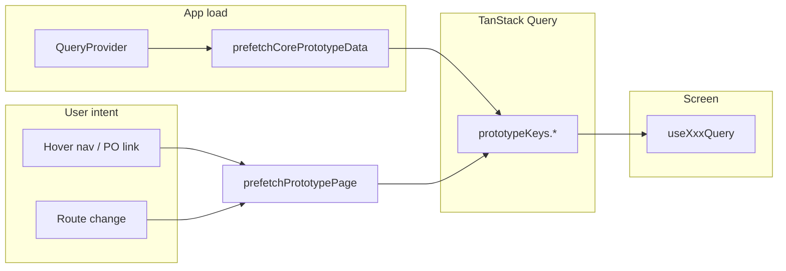
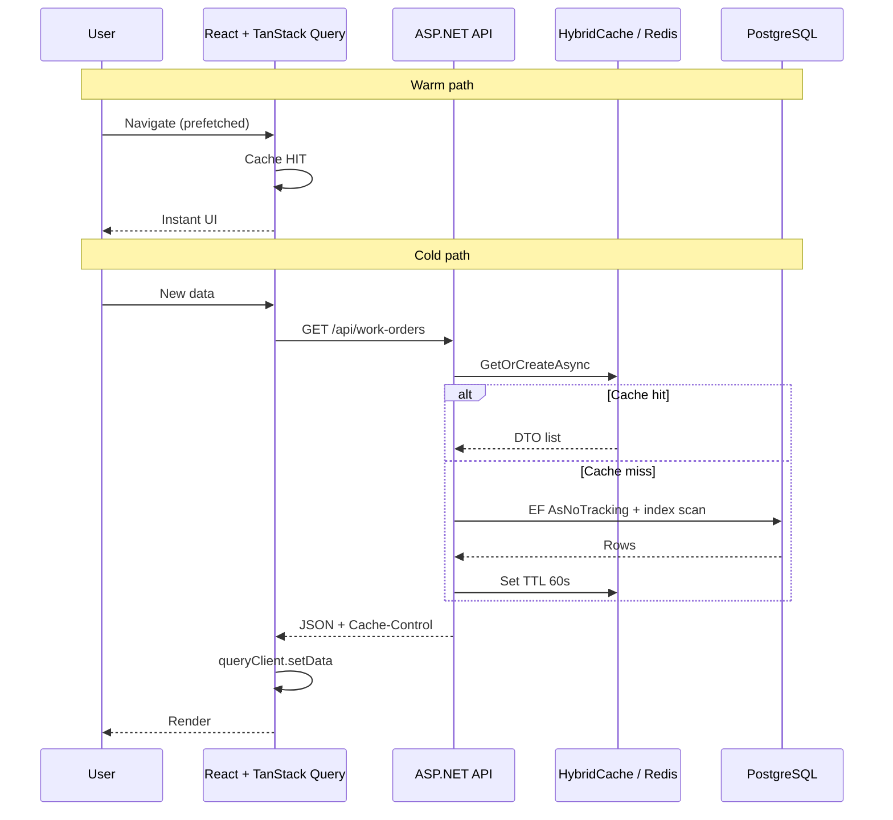

# Learning guide: fast apps (frontend + backend + database)

A study file for **perceived performance** and **real performance** — making software feel instant and keeping APIs and PostgreSQL fast under load. This guide matches patterns in **property_study** (`apps/shell`, `backend/RealEstateEval.Api`, PostgreSQL) and general industry practice.

**Last updated:** June 2026  
**Language:** English  
**Related:** `docs/DATABASE_OVERVIEW.md`, `docs/progress.md`

---

## Table of contents

### Foundations
1. [The one idea behind everything](#1-the-one-idea-behind-everything)
2. [Vocabulary](#2-vocabulary)
3. [Performance budget (all layers)](#3-performance-budget-all-layers)
4. [What we built in this project](#4-what-we-built-in-this-project)

### Frontend
5. [Frontend techniques (deep dive)](#5-frontend-techniques-deep-dive)
6. [Core Web Vitals and UX metrics](#6-core-web-vitals-and-ux-metrics)
7. [Next.js and React rendering performance](#7-nextjs-and-react-rendering-performance)

### Backend (.NET / API)
8. [Backend techniques (deep dive)](#8-backend-techniques-deep-dive)
9. [Entity Framework Core performance](#9-entity-framework-core-performance)

### Database (PostgreSQL)
10. [PostgreSQL performance (deep dive)](#10-postgresql-performance-deep-dive)
11. [Indexes: design rules and pitfalls](#11-indexes-design-rules-and-pitfalls)
12. [Finding slow queries in production](#12-finding-slow-queries-in-production)
13. [Maintenance: VACUUM, ANALYZE, connection pooling](#13-maintenance-vacuum-analyze-connection-pooling)

### Integration
14. [Full stack: how layers work together](#14-full-stack-how-layers-work-together)
15. [Libraries and when to pick them](#15-libraries-and-when-to-pick-them)
16. [Anti-patterns](#16-anti-patterns)
17. [Checklists](#17-checklists)
18. [Practice exercises](#18-practice-exercises-in-this-repo)
19. [Further reading](#19-further-reading)

---

## 1. The one idea behind everything

Users do not measure milliseconds in DevTools. They measure **“did the UI lie to me?”**

| Bad UX | Good UX |
|--------|---------|
| Flash `0` then real number | Show nothing or last value until real data |
| Blank page → spinner → content | Shell + cached content → quiet refresh |
| Click → wait → page | Hover already loaded data → click feels instant |
| API waits 800ms for slow + fast data | Fast data renders first; slow streams in |

**Core strategy (frontend):**

```text
Predict what they need next → prefetch early → store once → show cache immediately → revalidate in background if stale
```

**Core strategy (backend + DB):**

```text
Measure slow paths → fix query plans and indexes → cache safe reads → paginate lists → never do N+1 in loops
```

That is **stale-while-revalidate (SWR)** at the app layer, plus **speculative prefetch**, plus **correct SQL and caching** underneath.

---

## 2. Vocabulary

| Term | Meaning |
|------|---------|
| **Latency** | Time until first byte (TTFB) or full response |
| **p50 / p95 / p99** | Percentile latency — p95 is what “slow users” feel |
| **Perceived performance** | How fast it *feels* |
| **Cache hit** | Data served without recomputing or re-querying |
| **Stale** | Cached data older than freshness rules |
| **Revalidate** | Refresh cache from source of truth |
| **Prefetch** | Fetch before user explicitly asks |
| **Waterfall** | Request B starts only after A finishes |
| **Dedup** | One in-flight request, many subscribers |
| **Optimistic UI** | Update UI before server confirms |
| **Hydration** | Server cache passed to client on first paint |
| **TTFB** | Time to first byte of HTML/document |
| **LCP / INP / CLS** | Core Web Vitals (loading, responsiveness, stability) |
| **Seq Scan** | PostgreSQL reads whole table — often bad at scale |
| **Index Only Scan** | Answer query from index without heap visit |
| **N+1** | 1 query + N queries in a loop |
| **Cartesian explosion** | Huge join result from multiple `.Include()` |
| **TTL** | Time-to-live for cache entries |
| **Cache stampede** | Many requests miss cache at once and hammer DB |

**HTTP:** [RFC 5861 — stale-while-revalidate](https://tools.ietf.org/html/rfc5861) (browser/CDN).  
**App:** TanStack Query / SWR implement similar ideas in JavaScript memory.

---

## 3. Performance budget (all layers)

Before optimizing randomly, set **targets** per layer:

| Layer | What to measure | Good starting targets (internal admin app) |
|-------|-----------------|------------------------------------------|
| **Browser** | LCP, INP, CLS | LCP &lt; 2.5s, INP &lt; 200ms, CLS &lt; 0.1 |
| **Frontend data** | Cache hit rate on nav | Second visit to same page: 0 new API calls within `staleTime` |
| **API** | p95 per endpoint | List endpoints &lt; 300ms; detail &lt; 150ms (warm DB) |
| **Database** | `mean_exec_time`, `total_exec_time` | Top queries reviewed weekly via `pg_stat_statements` |

**Rule:** Optimize the layer that owns the bottleneck. A perfect React cache cannot fix a 3-second unindexed SQL query.

---

## 4. What we built in this project

### Frontend (TanStack Query)

| Piece | File | Role |
|-------|------|------|
| Query keys | `apps/shell/src/lib/query/prototype-keys.ts` | Same key = same cache bucket |
| Hooks + prefetch | `apps/shell/src/lib/query/prototype-queries.ts` | `staleTime` 60s, `gcTime` 10m |
| Boot warm cache | `apps/shell/src/providers/QueryProvider.tsx` | `prefetchCorePrototypeData` |
| Hover + route prefetch | `apps/shell/src/components/views/AppShell.tsx` | Intent-based prefetch |
| PO hover | `@case-study/mfe/components/ui/PoNumber.tsx` | `prefetchPoRecord` |
| Honest stats | `apps/shell/src/components/ui/StatValue.tsx` | No flash of `0` |
| Pending tables | `packages/design-system/.../prototype.css` | `data-pending` |
| Invalidation | `usePrototypeDataSync()` | Events + `storage` + focus |

### Backend + database (today)

| Area | Status | Performance note |
|------|--------|------------------|
| Users, auth, profiles | PostgreSQL + EF Core | Index FKs; use `AsNoTracking` on list reads |
| Work orders, courts (API) | PostgreSQL | Watch `.Include()` size; paginate lists |
| Workflow tasks, failures | `localStorage` prototype | React Query still helps; not DB yet |
| Postgres local | `realestate_eval_dev` | See `docs/DATABASE_OVERVIEW.md` |

### Zero-time recipe (frontend)



**Critical rule:** `prefetchQuery` and `useQuery` must share the **same `queryKey` and compatible `staleTime`**. See [TanStack prefetching](https://tanstack.com/query/latest/docs/framework/react/guides/prefetching).

---

## 5. Frontend techniques (deep dive)

### 5.1 Stale-while-revalidate (application cache)

Return cached data immediately; if stale, refetch in background.

```ts
useQuery({
  queryKey: ['po-list'],
  queryFn: loadPoListRows,
  staleTime: 60_000,
  gcTime: 600_000,
});
```

| Data type | Suggested `staleTime` |
|-----------|----------------------|
| Dashboard lists | 30s – 2 min |
| Reference catalogs (courts) | 5 – 15 min |
| User-specific task queue | 15 – 60s |
| Real-time auction / lock | 0 + WebSocket / polling |

---

### 5.2 Speculative prefetch (intent-based)

| Trigger | When to use |
|---------|-------------|
| **Hover** | Sidebar, PO links, table rows |
| **Focus** | Keyboard navigation (same as hover) |
| **Route enter** | `useEffect` on `currentPage` |
| **Next.js `<Link prefetch>`** | Static routes in App Router |
| **Viewport** | Infinite scroll next page |
| **`requestIdleCallback`** | Low-priority warm cache when browser idle |

```ts
void queryClient.prefetchQuery({
  queryKey: prototypeKeys.workflowTasks(),
  queryFn: loadWorkflowTasks,
  staleTime: 60_000,
});
```

SWR equivalent: [`preload(key, fetcher)`](https://swr.vercel.app/docs/prefetching).

---

### 5.3 Warm cache on boot

Prefetch high-traffic queries at login so the first screen is often instant. **Trade-off:** more work at startup; less on first click. Fits internal apps with repeated hub navigation.

---

### 5.4 Request deduplication

Ten components calling `useWorkflowTasksQuery()` → **one** network call. Centralize in hooks; never scatter raw `fetch`.

---

### 5.5 Avoid waterfalls

**Slow:**

```text
await poList → await tasks → await onePo
```

**Fast:**

```ts
await Promise.all([
  queryClient.prefetchQuery({ queryKey: poKeys, queryFn: loadPoRecords }),
  queryClient.prefetchQuery({ queryKey: taskKeys, queryFn: loadTasks }),
]);
```

---

### 5.6 Placeholder discipline

| Technique | Purpose |
|-----------|---------|
| `StatValue` + `undefined` | No fake `0` |
| `data-pending` on tables | Dim, don’t invent rows |
| Skeletons | Reserve layout space |
| `placeholderData: keepPreviousData` | Filter/tab changes without flash |

---

### 5.7 Optimistic updates

1. User saves → 2. UI updates → 3. API runs → 4. Confirm or rollback.

[TanStack optimistic updates](https://tanstack.com/query/latest/docs/framework/react/guides/optimistic-updates). Use for toggles and assignments; confirm for legal/financial deletes.

---

### 5.8 Server prefetch + hydration (Next.js)

**Cold first visit** needs server-side prefetch:

1. New `QueryClient` **per request** (never global on server).
2. `await queryClient.prefetchQuery(...)` or `void prefetchQuery` for streaming (v5.40+).
3. `dehydrate(queryClient)` → `<HydrationBoundary>`.
4. Client `useQuery` with same key — no spinner.
5. **`staleTime > 0`** on client or you double-fetch.
6. **`gcTime` not 0** during hydration or cache may GC before paint ([SSR guide](https://tanstack.com/query/latest/docs/framework/react/guides/ssr)).

**Streaming pending queries (TanStack v5.40+):**

```ts
// Server: start slow query without blocking HTML
void queryClient.prefetchQuery({ queryKey: ['heavy'], queryFn: slowApi });

return (
  <HydrationBoundary state={dehydrate(queryClient)}>
    <FastSection />
    <Suspense><SlowSection /></Suspense>
  </HydrationBoundary>
);
```

Configure dehydration to include pending queries when using this pattern — see [Advanced SSR](https://tanstack.com/query/v5/docs/framework/react/guides/advanced-ssr).

---

### 5.9 `useSuspenseQuery` vs `useQuery`

| Hook | Server render? | Best for |
|------|----------------|----------|
| `useSuspenseQuery` | Yes (with boundary) | Critical above-the-fold data |
| `useQuery` | No (client after hydrate) | Below fold, after interaction |

[TanStack Router + Query integration](https://tanstack.com/router/latest/docs/integrations/query): preload in route `loader`, stream with Suspense.

---

### 5.10 Virtualization

1000 DOM rows = jank. Use `@tanstack/react-virtual` or `react-window` when queues exceed ~100 rows.

---

### 5.11 Persist cache

`@tanstack/react-query-persist-client` → `sessionStorage` / IndexedDB. Survives F5; useful for flaky networks.

---

### 5.12 Real-time

| Method | Use |
|--------|-----|
| `refetchInterval` | Simple polling |
| **SSE** | One-way server push |
| **WebSocket** | Bidirectional |
| **SignalR** | Natural for ASP.NET Core |

On push: `queryClient.invalidateQueries({ queryKey })` — targeted, not full page reload.

---

## 6. Core Web Vitals and UX metrics

Google’s [Core Web Vitals](https://web.dev/articles/vitals) measure real user experience. **75th percentile** of page loads should pass:

| Metric | Measures | Good | Fix levers |
|--------|----------|------|------------|
| **LCP** | Loading — largest visible content | ≤ 2.5s | SSR/prefetch, smaller images, CDN, faster API for hero data |
| **INP** | Responsiveness — all interactions | ≤ 200ms | Less main-thread JS, debounce heavy handlers, avoid long tasks |
| **CLS** | Visual stability | ≤ 0.1 | Width/height on images, reserve ad space, no layout shift on font load |

**Diagnostics (not CWV but related):**

- **TTFB** — server + network; SSR hydration and API speed matter.
- **FCP** — first paint; often tracks TTFB.

**Tools:** [PageSpeed Insights](https://pagespeed.web.dev/), Chrome DevTools Performance, [Search Console CWV report](https://developers.google.com/search/docs/appearance/core-web-vitals), `web-vitals` npm package.

**How our patterns help:**

| Pattern | Helps |
|---------|-------|
| Prefetch + cache | LCP (content ready sooner) |
| `StatValue` / skeletons | CLS (reserved space) |
| Optimistic UI | INP (instant feedback) |
| Streaming SSR | LCP for fast sections while slow API continues |

---

## 7. Next.js and React rendering performance

### 7.1 Bundle size

- **Dynamic import:** `const Heavy = dynamic(() => import('./Heavy'), { ssr: false })` for charts/editors.
- **Analyze:** `@next/bundle-analyzer` — remove duplicate libraries.
- **Tree-shake:** import icons/utilities by path, not whole packages.

### 7.2 Server vs Client Components

- **Server Components:** fetch on server, zero JS for static UI.
- **`"use client"`:** only where state, effects, or browser APIs are needed.
- Smaller client bundle → better INP and faster hydration.

### 7.3 Images and fonts

- `next/image` with explicit `width`/`height` → helps **CLS**.
- `next/font` with `display: swap` and size fallback → fewer layout shifts.

### 7.4 Route-level prefetch

App Router `<Link href="..." prefetch>` prefetches route JS and RSC payload for visible links.

Combine with **your** TanStack `prefetchQuery` for API data — two layers (route + data).

---

## 8. Backend techniques (deep dive)

Frontend polish cannot fix a 2s SQL query. The API owns **serialization**, **caching headers**, **concurrency**, and **query shape**.

### 8.1 API design for speed

| Technique | Benefit |
|-----------|---------|
| **List vs detail DTOs** | Small list JSON; full graph only on `GET /{id}` |
| **Pagination** | `?page=1&pageSize=50` — never return 10k rows |
| **Compression** | `AddResponseCompression()` — Brotli/Gzip |
| **Batch endpoint** | `POST /api/batch` for many ids in one round-trip |
| **Field filtering** | Optional `?fields=` for mobile |

### 8.2 HTTP caching

```http
Cache-Control: public, max-age=60, stale-while-revalidate=300
ETag: "abc123"
```

| Header | Use |
|--------|-----|
| `max-age` | Fresh without revalidate |
| `ETag` / `If-None-Match` | **304 Not Modified** — no body |
| `private, no-store` | Personalized task queues |

[ASP.NET Core caching overview](https://learn.microsoft.com/en-us/aspnet/core/performance/caching/overview).

### 8.3 In-memory and distributed cache

**L1 — `IMemoryCache`:** single server, reference data, short TTL.

**L2 — Redis:** shared across API instances; invalidate on write.

**.NET 9+ HybridCache** ([Microsoft.Extensions.Caching.Hybrid](https://learn.microsoft.com/en-us/aspnet/core/performance/caching/hybrid)):

- L1 memory + L2 distributed in one API.
- **Stampede protection** — one query runs on cache miss, not thousands.

```csharp
await hybridCache.GetOrCreateAsync(
    $"courts-catalog",
    async cancel => await db.Courts.AsNoTracking().ToListAsync(cancel),
    cancellationToken: ct);
```

### 8.4 Output caching (ASP.NET)

`[OutputCache(Duration = 60)]` on safe GET endpoints — caches full response at middleware level.

### 8.5 Async and parallelism

Use `async/await` end-to-end; never `.Result` / `.Wait()` on request threads.

```csharp
await Task.WhenAll(
    _poService.GetListAsync(ct),
    _statsService.GetDashboardAsync(ct));
```

### 8.6 Background jobs

PDF, bulk import, email:

```text
POST → 202 Accepted + jobId
Worker processes
Client polls or SignalR
```

### 8.7 CQRS-lite

**Writes:** normalized tables, validation, transactions.  
**Reads:** denormalized view / materialized list for queues (deed label, specialist name pre-joined).

### 8.8 Dapper for hot reads

Some teams use **EF Core** for complex writes and **Dapper** for read-heavy, hand-tuned SQL. Optional when EF plans are not good enough after indexes.

### 8.9 Rate limiting

Keeps p95 stable under abuse — `AspNetCoreRateLimit` or built-in rate limiter (.NET 7+).

### 8.10 Observability

| Tool | Use |
|------|-----|
| Application Insights / OpenTelemetry | Trace API → DB |
| Structured logs | Correlation id per request |
| Health checks | `/health` for DB connectivity |

---

## 9. Entity Framework Core performance

Our API uses **EF Core** against PostgreSQL. These patterns apply directly.

### 9.1 `AsNoTracking()` for reads

```csharp
var rows = await db.WorkOrders
    .AsNoTracking()
    .Where(w => w.Status == status)
    .Select(w => new WorkOrderListDto { ... })
    .ToListAsync(ct);
```

Disables change tracking — less CPU and memory on list endpoints.

### 9.2 Projections — `Select` not full entities

```csharp
// Bad: loads all columns + navigation overhead
var all = await db.WorkOrders.Include(w => w.Properties).ToListAsync();

// Good: only what the API returns
var list = await db.WorkOrders
    .Select(w => new { w.Id, w.PoNumber, PropertyCount = w.Properties.Count })
    .ToListAsync();
```

### 9.3 Eager load vs N+1

**Bad (N+1):**

```csharp
foreach (var wo in workOrders) {
    wo.Properties = await db.Properties.Where(p => p.WorkOrderId == wo.Id).ToListAsync();
}
```

**Good:**

```csharp
var workOrders = await db.WorkOrders
    .Include(w => w.Properties)
    .AsNoTracking()
    .ToListAsync();
```

### 9.4 `AsSplitQuery()` — avoid cartesian explosion

Multiple `.Include()` on collections can multiply rows (huge result set).

```csharp
await db.WorkOrders
    .Include(w => w.Properties)
    .Include(w => w.Parties)
    .AsSplitQuery()
    .AsNoTracking()
    .ToListAsync();
```

Issues **multiple SQL queries** but avoids giant JOIN — often faster. [EF split queries](https://learn.microsoft.com/en-us/ef/core/querying/single-split-queries).

### 9.5 Compiled queries

For hot paths called thousands of times:

```csharp
private static readonly Func<AppDbContext, int, Task<WorkOrder?>> GetById =
    EF.CompileAsyncQuery((AppDbContext db, int id) =>
        db.WorkOrders.AsNoTracking().FirstOrDefault(w => w.Id == id));
```

### 9.6 DbContext pooling

```csharp
services.AddDbContextPool<AppDbContext>(options => ...);
```

Reuses context instances — lower allocation overhead per request.

### 9.7 Pagination

```csharp
var page = await query
    .OrderBy(w => w.Id)
    .Skip((pageNumber - 1) * pageSize)
    .Take(pageSize)
    .ToListAsync();
```

For large tables prefer **keyset pagination** (see §10.6).

### 9.8 Logging SQL in development

```csharp
options.LogTo(Console.WriteLine, LogLevel.Information);
options.EnableSensitiveDataLogging(); // dev only
```

Or EF Core logging category `Microsoft.EntityFrameworkCore.Database.Command`.

---

## 10. PostgreSQL performance (deep dive)

**property_study** uses **PostgreSQL** (`realestate_eval_dev`). Most performance wins for API speed happen here once tables grow.

### 10.1 Always measure with `EXPLAIN`

**Plan only (safe):**

```sql
EXPLAIN (FORMAT TEXT)
SELECT * FROM "WorkOrders" WHERE "Status" = 'Active';
```

**Real timings + I/O (runs query):**

```sql
EXPLAIN (ANALYZE, BUFFERS, FORMAT TEXT)
SELECT ...;
```

**What to look for** ([EnterpriseDB guide](https://www.enterprisedb.com/blog/postgresql-query-optimization-performance-tuning-with-explain-analyze), [DEV EXPLAIN guide](https://dev.to/pockit_tools/postgresql-query-performance-the-complete-explain-analyze-guide-for-developers-whove-had-enough-47nf)):

| Signal | Often means |
|--------|-------------|
| **Seq Scan** on large table + selective `WHERE` | Missing or wrong index |
| **Rows Removed by Filter** high | Index not selective enough |
| **Actual rows >> Estimated rows** | Stale statistics → run `ANALYZE` |
| **Buffers: shared read** high on repeat run | Working set bigger than `shared_buffers` |
| **Sort** spilling to disk | Increase `work_mem` or add index that avoids sort |

Run `EXPLAIN` on **realistic data volume** — on empty dev DB the planner may choose Seq Scan incorrectly.

### 10.2 The four common problem classes

([llmbestpractices Postgres guide](https://llmbestpractices.com/howto/optimize-postgres-query))

1. **Missing index**
2. **Stale statistics** (`ANALYZE` not run)
3. **Too-large result set** (no `LIMIT`, no pagination)
4. **Wrong join order** (fix with stats, indexes, or rewrite)

### 10.3 Example: work order list (future-heavy table)

When `WorkOrders` grows, a list filtered by status and sorted by date might need:

```sql
CREATE INDEX CONCURRENTLY idx_work_orders_status_created
ON "WorkOrders" ("Status", "CreatedAt" DESC);
```

Equality column (`Status`) **before** range/sort column (`CreatedAt`) in composite indexes.

### 10.4 Foreign keys need indexes

PostgreSQL does **not** auto-index FK columns. If you join or filter on `UserId`, `WorkOrderId`, etc., add indexes on those columns.

### 10.5 SSD planner tuning

On SSD storage, many teams lower `random_page_cost` (e.g. toward **1.1**) so the planner prefers index scans over sequential scans when appropriate. Change only with measurement — [FulmenFlux guide](https://fulmenflux.co/blog/postgresql-query-optimization-guide/).

---

## 11. Indexes: design rules and pitfalls

### 11.1 Composite indexes (equality first)

```sql
-- Query: WHERE status = 'Active' AND created_at >= '2026-01-01'
CREATE INDEX idx_wo_status_created ON work_orders (status, created_at);
```

Put **equality** columns first, **range/sort** second.

### 11.2 Covering indexes (`INCLUDE`)

```sql
CREATE INDEX idx_wo_list_covering ON work_orders (status, created_at)
INCLUDE (po_number, title);
```

Enables **Index Only Scan** — query answered from index without heap fetch ([index guide](https://llmbestpractices.com/howto/optimize-postgres-query)).

### 11.3 Partial indexes (skewed data)

```sql
CREATE INDEX idx_wo_active ON work_orders (created_at)
WHERE deleted_at IS NULL AND status = 'Active';
```

Smaller index when most queries hit a subset of rows.

### 11.4 When NOT to index

- Tiny tables (planner uses Seq Scan anyway)
- Low-cardinality columns alone (e.g. boolean flag)
- Columns rarely in `WHERE` / `JOIN`
- Too many redundant indexes (slow writes)

### 11.5 Pitfalls ([Cubbit: 12 indexing pitfalls](https://medium.com/cubbit/optimizing-postgresql-queries-12-indexing-pitfalls-and-how-we-fixed-them-81c25615a84e))

- Implicit type casts in `WHERE` — index not used
- `OR` across columns — may need separate indexes or rewrite
- Function on column: `WHERE lower(email) = ...` — use expression index or store normalized
- Stale stats after bulk load — run `ANALYZE`

**Production:** create indexes with `CREATE INDEX CONCURRENTLY` to avoid long write locks.

---

## 12. Finding slow queries in production

### 12.1 `pg_stat_statements` (essential)

Extension aggregates **normalized** query stats across the server ([PostgreSQL docs](https://www.postgresql.org/docs/17/pgstatstatements.html)).

**Enable (requires restart once):**

```conf
# postgresql.conf
shared_preload_libraries = 'pg_stat_statements'
```

```sql
CREATE EXTENSION IF NOT EXISTS pg_stat_statements;
```

**Top capacity hogs (total time):**

```sql
SELECT
  substring(query, 1, 80) AS short_query,
  calls,
  round(total_exec_time::numeric, 2) AS total_ms,
  round(mean_exec_time::numeric, 2) AS mean_ms,
  round((100.0 * total_exec_time / sum(total_exec_time) OVER ())::numeric, 1) AS pct_total
FROM pg_stat_statements
ORDER BY total_exec_time DESC
LIMIT 20;
```

| Sort by | Finds |
|---------|-------|
| `total_exec_time` | “Death by a thousand cuts” — fast query × millions of calls |
| `mean_exec_time` | Outliers — occasional 5s monsters |

Combine with `EXPLAIN (ANALYZE, BUFFERS)` on the normalized pattern. Reset window periodically: `SELECT pg_stat_statements_reset();`

Overhead is typically ~1–2% CPU — worth it ([Ivan Luminaria case study](https://ivanluminaria.com/en/posts/postgresql/pg-stat-statements/)).

### 12.2 Other system views

| View | Purpose |
|------|---------|
| `pg_stat_activity` | What is running **right now** |
| `pg_stat_user_tables` | Seq scans vs index scans per table |
| `pg_stat_user_indexes` | Unused indexes (`idx_scan` near 0) |

### 12.3 ORM + DB together

1. Enable EF SQL logging in dev.
2. Copy slow SQL to `EXPLAIN ANALYZE` in pgAdmin or `psql`.
3. Add index or rewrite query.
4. Verify in `pg_stat_statements` after deploy.

---

## 13. Maintenance: VACUUM, ANALYZE, connection pooling

### 13.1 `ANALYZE` — planner statistics

After large inserts/updates:

```sql
ANALYZE "WorkOrders";
```

**Autovacuum** should run regularly; if estimates are wrong, plans degrade (Index Scan → Seq Scan).

### 13.2 `VACUUM` — dead tuples and bloat

Updates/deletes leave dead rows. **Autovacuum** reclaims space and updates visibility map (helps Index Only Scan).

Watch tables with high churn: `n_dead_tup` in `pg_stat_user_tables`.

### 13.3 Connection pooling

Each HTTP request should not open a new raw DB connection storm.

| Layer | Tool |
|-------|------|
| .NET | Npgsql pooling (default with connection string) |
| Postgres | **PgBouncer** in transaction mode for many API instances |

Rule of thumb: cap DB connections; pool at app + PgBouncer ([FulmenFlux connection tuning](https://fulmenflux.co/blog/postgresql-query-optimization-guide/)).

### 13.4 Keyset (cursor) pagination

**Offset** pagination (`OFFSET 10000`) gets slow — Postgres must scan skipped rows.

**Keyset:**

```sql
SELECT * FROM work_orders
WHERE id > @lastId
ORDER BY id
LIMIT 50;
```

Requires stable sort key (usually primary key or `(created_at, id)`).

---

## 14. Full stack: how layers work together



| Layer | Lifetime | Survives F5? | Shared users? |
|-------|----------|--------------|---------------|
| React Query memory | Minutes | No | No |
| Persisted query cache | Session | Tab session | No |
| `IMemoryCache` / Hybrid L1 | Minutes | No | Per server |
| Redis L2 | Minutes–hours | Yes | Yes |
| HTTP CDN/browser | Per headers | Yes | Public GET only |
| PostgreSQL | Permanent | Yes | Yes |

**Golden rule:** Fastest data is data you never fetch twice at the same layer.

---

## 15. Libraries and when to pick them

### Frontend

| Library | Best for |
|---------|----------|
| **TanStack Query** | REST apps, prefetch, mutations — **we use this** |
| **SWR** | Simpler API, Vercel ecosystem |
| **RTK Query** | Redux already central |
| **Apollo / urql** | GraphQL |
| **tRPC** | Full-stack TypeScript |

### Backend

| Tool | Role |
|------|------|
| **EF Core** | ORM — N+1, split queries |
| **Dapper** | Tuned read SQL |
| **HybridCache** | L1+L2 + stampede protection (.NET 9+) |
| **SignalR** | Push invalidation to clients |
| **Hangfire** | Background jobs |

### Database

| Tool | Role |
|------|------|
| **pg_stat_statements** | Find slow/normalized queries |
| **PgBouncer** | Connection pooling |
| **pgAdmin / DBeaver** | EXPLAIN visual plans |

---

## 16. Anti-patterns

| Mistake | Symptom | Fix |
|---------|---------|-----|
| `staleTime: 0` | Prefetch useless | `staleTime: 60_000` |
| Mismatched `queryKey` | Always miss cache | `prototype-keys.ts` |
| Waterfall prefetches | Slow TTFB | `Promise.all` / `void` + Suspense |
| Fake `0` in UI | Wrong trust | `StatValue`, skeletons |
| N+1 in EF loop | API p95 explodes | `.Include` / projection |
| Giant `.Include()` | Memory spike | `.AsSplitQuery()` or separate query |
| No pagination | Timeouts | `Take` + keyset |
| Seq Scan on big table | DB CPU high | Index + `ANALYZE` |
| Cache personalized GET at CDN | Data leak | `private, no-store` |
| Global server `QueryClient` | User A sees B | Per-request client |
| Unused indexes | Slow writes | Drop after `pg_stat_user_indexes` review |

---

## 17. Checklists

### Frontend feature

- [ ] Shared `queryKey` in one module
- [ ] `useXxxQuery` hook (no scattered `fetch`)
- [ ] `staleTime` matches data change rate
- [ ] Prefetch on hover/route for likely next screen
- [ ] Loading UI does not show false numbers
- [ ] Mutations invalidate or update cache
- [ ] Independent fetches parallelized
- [ ] LCP element not blocked by slow secondary API (Suspense/stream)

### Backend endpoint

- [ ] `AsNoTracking` + DTO projection on lists
- [ ] No N+1; split query if many includes
- [ ] Pagination enforced
- [ ] Compression enabled
- [ ] Cache only safe, shared reads
- [ ] p95 measured
- [ ] Background job for work &gt; 2–3s

### Database change

- [ ] `EXPLAIN (ANALYZE, BUFFERS)` on realistic volume
- [ ] Index matches `WHERE` + `ORDER BY` column order
- [ ] FK columns indexed
- [ ] `ANALYZE` after bulk load
- [ ] Query appears in `pg_stat_statements` review
- [ ] No unbounded `SELECT *` in production code paths

---

## 18. Practice exercises in this repo

### A — Trace prefetch (frontend)

1. DevTools → Network.  
2. Hover **البيانات الأولية**, then click.  
3. Compare request count with/without `staleTime`.  
4. Read `AppShell.tsx` + `prototype-queries.ts`.

### B — React Query Devtools

Install devtools; watch cache fill on boot and on hover.

### C — EXPLAIN a work order query (database)

When PO/work order tables are loaded in dev:

1. Run API list endpoint with EF logging.  
2. Copy SQL → `EXPLAIN (ANALYZE, BUFFERS)` in pgAdmin.  
3. Note Seq Scan vs Index Scan.

### D — `pg_stat_statements` (local Docker Postgres)

1. Add extension to `infra` Postgres config if not present.  
2. Run top-20 query after clicking through the app.  
3. Identify highest `total_exec_time`.

### E — EF `AsSplitQuery` experiment (backend)

1. List work orders with two collection includes.  
2. Compare memory and time with vs without `AsSplitQuery()`.

### F — Core Web Vitals (frontend)

1. Lighthouse on `/dashboard` (production build).  
2. Note LCP element and TTFB.  
3. List one change for LCP and one for CLS.

---

## 19. Further reading

### TanStack / Next.js

- [Prefetching](https://tanstack.com/query/latest/docs/framework/react/guides/prefetching)  
- [SSR & hydration](https://tanstack.com/query/latest/docs/framework/react/guides/ssr)  
- [Advanced SSR (streaming pending)](https://tanstack.com/query/v5/docs/framework/react/guides/advanced-ssr)  
- [Optimistic updates](https://tanstack.com/query/latest/docs/framework/react/guides/optimistic-updates)  
- [TanStack Router + Query](https://tanstack.com/router/latest/docs/integrations/query)  
- [Render-as-you-fetch + Next.js](https://devcheolu.com/en/posts/P6F08DS8qBvW0eQDlEtR)

### Frontend UX metrics

- [web.dev — Web Vitals](https://web.dev/articles/vitals)  
- [Google Search Central — CWV](https://developers.google.com/search/docs/appearance/core-web-vitals)  
- [SWR prefetching](https://swr.vercel.app/docs/prefetching)  
- [RFC 5861 — stale-while-revalidate](https://tools.ietf.org/html/rfc5861)

### ASP.NET Core / EF Core

- [ASP.NET Core caching](https://learn.microsoft.com/en-us/aspnet/core/performance/caching/overview)  
- [HybridCache](https://learn.microsoft.com/en-us/aspnet/core/performance/caching/hybrid)  
- [EF Core split queries](https://learn.microsoft.com/en-us/ef/core/querying/single-split-queries)  
- [Telerik — API performance tips](https://www.telerik.com/blogs/tips-improving-api-performance-aspnet-core)  
- [EF Core REST performance guide](https://haquea.com/the-ultimate-guide-to-ef-cores-rest-api-performance/)

### PostgreSQL

- [PostgreSQL `pg_stat_statements` docs](https://www.postgresql.org/docs/17/pgstatstatements.html)  
- [EDB — EXPLAIN ANALYZE](https://www.enterprisedb.com/blog/postgresql-query-optimization-performance-tuning-with-explain-analyze)  
- [FulmenFlux — optimization guide](https://fulmenflux.co/blog/postgresql-query-optimization-guide/)  
- [llmbestpractices — optimize a query](https://llmbestpractices.com/howto/optimize-postgres-query)  
- [Cubbit — indexing pitfalls](https://medium.com/cubbit/optimizing-postgresql-queries-12-indexing-pitfalls-and-how-we-fixed-them-81c25615a84e)  
- [Webalert — production monitoring](https://web-alert.io/blog/postgresql-monitoring-production-slow-queries-replication-guide)  
- [Severalnines — pg_stat_statements vs pg_stat_monitor](https://severalnines.com/blog/query-observability-and-performance-tuning-with-pg_stat_monitor-and-pg_stat_statements/)

### Patterns & architecture

- [Sujeet Jaiswal — data fetching patterns](https://sujeet.pro/articles/data-fetching-patterns)  
- [ECOSIRE — React Query guide](https://ecosire.com/blog/react-query-data-fetching-guide)  
- [Webeyez — EF Core cache & query guide](https://webeyez.com/insights/guides/ef-core-cache-query-guide)

### This repo

- `docs/DATABASE_OVERVIEW.md` — schema and connection  
- `docs/progress.md` — what is API-backed vs prototype  
- `infra/docker-compose.yml` — local Postgres  

---

## Quick reference card

```text
FRONTEND:  PREDICT → prefetch | CACHE → same queryKey + staleTime>0
           SHOW → no fake data | STREAM → Suspense + void prefetch

BACKEND:   DTO + paginate | AsNoTracking | parallel Task.WhenAll
           HybridCache/Redis | 304 ETag on safe GETs

DATABASE:  EXPLAIN (ANALYZE, BUFFERS) | index (equality, range)
           ANALYZE after bulk | pg_stat_statements weekly
           no N+1 | keyset pagination at scale

MEASURE:   LCP/INP/CLS + API p95 + total_exec_time in Postgres
```

---

*Learning document only. Product routes and behavior: `docs/progress.md`, `docs/SYSTEM_BEHAVIOR_PM_REVIEW.md`.*
