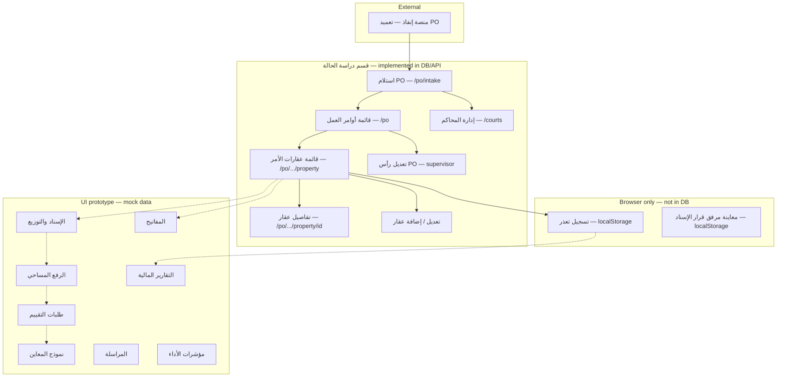

# System Behavior — PM Review Document

**Project:** Ejada Internal (نظام إجادة الداخلي) — Real Estate Evaluation & Case Study  
**Audience:** Project managers, product owners, business analysts  
**Last updated:** 21 May 2026  
**Purpose:** Describe how the application behaves **today** (screens, roles, data persistence, backend APIs) and the **intended work cycle** for analysis and planning.

> **Note:** Some older docs (e.g. `docs/DATABASE_OVERVIEW.md` executive summary) still say PO/properties are “not in the database.” That is **out of date**. This document reflects the **current codebase**; technical changelog detail lives in `docs/progress.md`.

---

## 1. Executive summary

| Layer | Maturity today |
|--------|----------------|
| **UI shell** | Production-quality Arabic RTL layout (sidebar, top bar, cards, tables). Full-viewport layout (`100vh`); sparse pages show empty area below content. |
| **Authentication** | **Real:** JWT login against ASP.NET Identity (`POST /api/auth/login`). Session token in browser storage. |
| **Role simulation** | **Prototype only:** Sidebar “تبديل الدور” switches a **demo role** in `sessionStorage`. This controls **which menu items appear** and **PO/failure permissions** — it is **not** the same as Identity roles on the logged-in user. |
| **User management** | **Real API + PostgreSQL:** Register (HR / Proc / CRM), list users, organization view. No edit/deactivate user in UI yet. |
| **Work orders (PO) & properties** | **Real API + PostgreSQL:** Create/list/edit/delete PO; add/edit/delete properties; courts catalog. |
| **Failures (تعذر)** | **Browser `localStorage` only** — not in PostgreSQL. Can update deed status on property via API when failure is saved. |
| **Attachments (قرار إسناد / سجل عقاري)** | **Filename in DB**; image preview in **`localStorage`** on the machine that uploaded the file. |
| **Most other modules** | **Static mock data** in frontend constants (assignment, survey, keys, valuation requests, messages, financial, KPI, dashboard team/VR snippets). |

**Bottom line for PM:** The case-study path **استلام أمر عمل → تسجيل عقارات → قائمة/تفاصيل/تعديل** is wired end-to-end to the backend. Everything around **توزيع الأحمال، التقييم، المسح، المفاتيح، المراسلة، المالية** is UI demonstration until product defines APIs and persistence.

---

## 2. How to run (reviewers)

```bash
# PostgreSQL
docker compose -f infra/docker-compose.yml up -d postgres

# API (applies EF migrations + seed)
cd backend/RealEstateEval.Api && dotnet run

# Frontend (monorepo root)
npm install && npm run dev
```

| Item | Value |
|------|--------|
| Frontend | Typically `http://localhost:3000` |
| API | See `backend/RealEstateEval.Api/Properties/launchSettings.json` (often `http://localhost:5xxx`) |
| Default admin login | `admin@local.dev` / `Admin123!` |
| Database | `realestate_eval_dev` on `localhost:5432` |

Without API + login, PO and user screens cannot load persisted data (client returns empty or shows auth errors).

---

## 3. Authentication and access model

### 3.1 Real login

| Step | Behavior |
|------|----------|
| User opens `/login` | Email + password form |
| Success | JWT stored; user redirected into app shell |
| Protected API calls | `Authorization: Bearer <token>` |
| Current user | `GET /api/auth/me` |

### 3.2 Prototype role switcher (sidebar)

After login, reviewers can switch among **11 demo personas** (CDO, general manager, case specialist, etc.). This:

- Shows/hides sidebar modules per role (`ROLES` in `packages/app-shared/src/prototype/constants.ts`)
- Gates PO actions (`@case-study/mfe` `po-roles.ts`)
- Does **not** change the JWT or server-side authorization on work orders (any authenticated user can call work-order APIs today)

**Implication for analysis:** UX permission tests use the **role dropdown**, not separate user accounts per role (unless you create users in DB and extend backend policies later).

---

## 4. Application routes and pages

### 4.1 Public / entry

| Route | Screen | Data source |
|-------|--------|-------------|
| `/` | Redirects into app or login | — |
| `/login` | Login | Auth API |
| `/welcome` | Redirect | → `/dashboard` (`next.config`) |

### 4.2 Main modules (`/{page}`)

Dynamic route: `apps/shell/src/app/(app)/[page]/page.tsx`.  
`/properties` and bare `/po` redirect to **`/po`** (PO list).

| Route | Arabic (nav) | Component | Data source |
|-------|----------------|-----------|-------------|
| `/dashboard` | لوحة التحكم | `DashboardView` | **Mixed:** property stats + active POs from **API**; valuation table rows from **MOCK_VR**; team cards from **MOCK** |
| `/po` | أوامر العمل | `PoListView` | **API** |
| `/assignment` | *(legacy URL)* | — | Redirects to `/dashboard` |
| `/survey` | الرفع المساحي | `SurveyView` | **Mock** offices |
| `/keys` | إدارة المفاتيح | `KeysView` | **Mock** properties with `key: true` |
| `/failures` | إدارة التعذرات | `FailuresView` | **`localStorage`** (`evalFailureRecords`) |
| `/valuation-requests` | طلبات التقييم | `ValuationRequestsView` | **Mock** VR rows |
| `/field-form` | نموذج المعاين | `FieldFormView` | **Mock** / static form UI |
| `/messages` | المراسلة الداخلية | `MessagesView` | **Mock** messages |
| `/financial` | التقارير المالية | `FinancialView` | **Mock** |
| `/kpi` | مؤشرات الأداء | `KpiView` | **Mock** |
| `/users` | إدارة المستخدمين | `UsersView` | **API** (+ registration wizards) |
| `/courts` | المحاكم والدوائر | `CourtsView` | **API** (catalog); supervisor edit |

Properties are accessed **per PO** only (`/po/{poNumber}/property`). For active-transaction queues (البيانات الأولية، بورصة، توزيع، دراسة حالة)، see `docs/progress.md` sections 5.3 and 8.

### 4.3 Work order (PO) sub-routes

| Route | Purpose | Who can act (prototype role) | Data |
|-------|---------|------------------------------|------|
| `/po/intake` | استلام أمر عمل جديد (**خطوة واحدة**: بيانات PO فقط) | Case specialist (`canReceivePo`) | **API** create with **zero properties**; draft in **`localStorage`** (`evalPoIntakeDraft`) |
| `/bourse-inquiry` | استعلام البورصة — قائمة صكوك بانتظار بيانات البورصة | Case specialist, section supervisor, operations coordinator | **API** `GET …/pending-bourse`, `PUT …/bourse` |
| `/po/{po}/property/new` | إضافة عقار (مرحلة إنفاذ، مكدس) | Case specialist | **API** add property (Enfath fields only) |
| `/po/{poNumber}/edit` | Edit PO header only | Section supervisor | **API** |
| `/po/{poNumber}/property` | قائمة العقارات for one PO | View all; edit if case specialist | **API** |
| `/po/{poNumber}/property/new` | Add property | Case specialist | **API** |
| `/po/{poNumber}/property/{id}` | Property detail (read-only cards) | All with PO access | **API** |
| `/po/{poNumber}/property/{id}/edit` | Edit property | Case specialist | **API** |
| `/po/{poNumber}/property/{id}/failure` | Report تعذر | Case specialist / preparer (via form) | **localStorage** + may **API** update deed status |

**PO list actions:** eye icon → property list; edit header / delete PO / intake button per `po-roles.ts`.

**General manager:** `isPoViewOnly` — list and view only, no intake/edit/delete.

---

## 5. Role × module access (navigation)

Roles are defined in `packages/app-shared/src/prototype/constants.ts`. “✓” = menu item visible; “—” = hidden (locked in sidebar).

| Module | CDO / GM | Section supervisor | Ops coordinator | Case specialist | Report preparer | Court delegate | Valuation coord. | Appraiser | Field inspector | Financial |
|--------|:--:|:--:|:--:|:--:|:--:|:--:|:--:|:--:|:--:|:--:|
| Dashboard | ✓ | ✓ | ✓ | ✓ | ✓ | ✓ | ✓ | ✓ | ✓ | ✓ |
| PO | ✓ | ✓ | ✓ | ✓ | ✓ | — | — | — | — | — |
| Assignment | ✓ | ✓ | ✓ | — | — | — | — | — | — | — |
| Survey | ✓ | ✓ | ✓ | — | — | — | — | — | — | — |
| Keys | ✓ | ✓ | — | — | — | ✓ | — | — | — | — |
| Failures | ✓ | ✓ | — | ✓ | ✓ | — | — | — | — | — |
| Valuation requests | ✓ | ✓ | — | — | — | — | ✓ | ✓ | — | — |
| Field form | ✓ | — | — | — | — | — | — | — | ✓ | — |
| Messages | ✓ | ✓ | ✓ | ✓ | ✓ | ✓ | ✓ | ✓ | ✓ | ✓ |
| Financial | ✓ | ✓ | — | — | — | — | — | — | — | ✓ |
| KPI | ✓ | ✓ | ✓ | — | — | — | — | — | — | — |
| Users | ✓ | ✓ | — | — | — | — | — | — | — | — |
| Courts | ✓ | ✓ | — | — | — | — | — | — | — | — |

### 5.1 PO-specific permissions (prototype rules)

| Action | Allowed roles |
|--------|----------------|
| استلام PO جديد (`/po/intake`) | `case-specialist` |
| Edit PO header | `section-supervisor` |
| Add / edit / delete property | `case-specialist` |
| Delete entire PO | `section-supervisor` **or** `case-specialist` |
| View PO (no mutations) | `general-manager` (+ others with PO in nav) |
| Edit courts catalog | `section-supervisor` |

---

## 6. Backend API (current)

Base path: `/api`. Unless noted, endpoints require **JWT** (`[Authorize]`).

### 6.1 Auth — `AuthController`

| Method | Route | Description |
|--------|-------|-------------|
| POST | `/api/auth/login` | Email/password → JWT + user info |
| GET | `/api/auth/me` | Current user (authenticated) |

### 6.2 Users — `UsersController` (policy: authenticated)

| Method | Route | Description |
|--------|-------|-------------|
| GET | `/api/users` | List registered users (expandable detail sections) |
| GET | `/api/users/organization` | Organization overview for users screen |
| POST | `/api/users/hr` | Create user from HR wizard |
| POST | `/api/users/proc` | Create user from service-provider wizard |
| POST | `/api/users/crm` | Create user from client wizard |
| DELETE | `/api/users/registered` | Delete all registered users (dev/admin utility) |

**Not implemented:** update user, deactivate, password reset APIs for the list screen.

### 6.3 Work orders — `WorkOrdersController`

| Method | Route | Description |
|--------|-------|-------------|
| GET | `/api/work-orders` | List PO summaries (counts, dates, specialist) |
| GET | `/api/work-orders/exists?poNumber=` | Duplicate PO check (intake) |
| GET | `/api/work-orders/deeds/prior?deedNumber=&excludePo=` | Prior registration of deed on another PO |
| GET | `/api/work-orders/{poNumber}` | Full PO + properties + contacts |
| POST | `/api/work-orders` | Create PO with ≥1 property |
| PUT | `/api/work-orders/{poNumber}` | Update header only |
| DELETE | `/api/work-orders/{poNumber}` | Delete PO and all properties |
| POST | `/api/work-orders/{poNumber}/properties` | Add property |
| PUT | `/api/work-orders/{poNumber}/properties/{propertyId}` | Update property |
| DELETE | `/api/work-orders/{poNumber}/properties/{propertyId}` | Remove property (blocked if last property) |

**Server business rules (high level):**

- Assignment types: **تنفيذ**, **تركات**, **قطاع خاص**
- **تنفيذ:** each property must have assignment decree **filename**; court/circuit fields apply in UI
- **Due date:** 4 **business days** after Enfath receipt (Sun–Thu; Fri/Sat off); receipt day not counted; default receipt time `10:00` if omitted
- Contacts: ≥1 with name + phone (≥10 digits)
- Unique `PoNumber`; unique deed per PO; duplicate deed across POs flagged via prior-deed endpoint
- Real-estate registration identifier: registration file **filename** required

### 6.4 Courts — `CourtsController`

| Method | Route | Description |
|--------|-------|-------------|
| GET | `/api/courts` | List courts/circuits (auto-seed if empty) |
| PUT | `/api/courts` | Replace catalog |

---

## 7. Database — what is persisted

PostgreSQL database: `realestate_eval_dev`.

### 7.1 Identity & users (implemented)

- ASP.NET Identity: `Users`, `Roles`, `UserRoles`, …
- `UserProfiles` + `HrEmployeeProfiles` / `ProcServiceProviderProfiles` / `CrmClientProfiles`
- Seeded admin and roles: `Admin`, `Supervisor`, `Editor`, `Reader`

See `docs/DATABASE_OVERVIEW.md` for table-level detail on **users only** (PO section there may be stale).

### 7.2 Case study — work orders (implemented)

Migration: `AddCaseStudyWorkOrders`.

| Table | Stores |
|-------|--------|
| `WorkOrders` | PO number, assignment type, Enfath receipt date/time, internal assignment date, specialist, due date, registered-by user |
| `WorkOrderProperties` | Deed/reg data, location, classification/type, court/circuit, deed status, **attachment filenames only** |
| `PropertyContacts` | Name, phone, sort order per property |
| `CourtCatalogEntries` | City → court → circuits (JSON) |

### 7.3 Not in database (today)

| Data | Where it lives |
|------|----------------|
| Failure (تعذر) records | `localStorage` key `evalFailureRecords` |
| Assignment decree / reg file **binary** | `localStorage` preview cache (`assignment-doc-attachments.ts`) |
| Property workflow stages (مسح / تقييم / دراسة) | **Computed in UI** from rules + failures — not stored as workflow state |
| Messages, financial, KPI, assignment workload | Frontend mocks |
| PO intake step-1 draft | `localStorage` `evalPoIntakeDraft` |

---

## 8. Current work cycle (for analysis)

This section describes **what the product demonstrates now** versus **what a full operational cycle would require** (many steps are UI-only or derived).

### 8.1 Diagram — implemented path (solid) vs planned (dashed)



### 8.2 Step-by-step — case study (operational today)

| # | Step | Actor (typical) | System behavior |
|---|------|-----------------|-----------------|
| 1 | Receive assignment from Enfath | Case specialist | User copies PO number, dates, assignment type into wizard |
| 2 | Step 1 — PO header | Case specialist | Validates duplicate PO via API; computes **due date** (4 business days); draft can sit in browser storage |
| 3 | Step 2 — Register properties | Case specialist | One or more properties: deed/reg, location, classification→type, contacts, court (if تنفيذ), decree **file name** + local preview |
| 4 | Submit | Case specialist | `POST /api/work-orders` persists PO + properties; redirect to PO list |
| 5 | Monitor PO list | Supervisor / GM / specialist | Stats from API; progress bar uses `done` count (currently **0** until real completion tracking exists); past-due highlighting on due date |
| 6 | Open properties | Any with access | Eye icon → `/po/{po}/property` table |
| 7 | View property detail | Any with access | Read-only cards (deed, contacts, decree preview if cached locally) |
| 8 | Edit property | Case specialist | Full form; API update; cannot delete last property on PO |
| 9 | Report failure | Specialist / preparer | Form on `/failure` or failures module; stored in **localStorage**; may set deed status **موقوف** / **قيد التحقق** via property API |
| 10 | Supervisor failure review | Section supervisor | Failures list: submit for review → approve/return (localStorage statuses) |
| 11 | Edit PO header | Section supervisor | Assignment type, dates, specialist — API `PUT` header |
| 12 | Maintain courts | Section supervisor | Updates catalog used in property forms |

### 8.3 Property status shown in lists (derived — not workflow engine)

The UI builds a **synthetic** `PropertyRow` for tables (`poPropertyToPropertyRow`):

| Display status | How it is determined |
|----------------|----------------------|
| **جديد** | Default when complete contact data and no failure |
| **ناقص** | Incomplete contact (name/phone rules) |
| **قيد التنفيذ** | Deed status **قيد التحقق** (often after failure flow) |
| **متعذر** | Approved failure in localStorage **or** deed **موقوف** |
| **مكتمل** | Not driven by real survey/valuation/study completion yet |

Columns **مسح / تقييم / دراسة** on any global property table use rules such as: prior deed waives survey to “done”; valuation/study stay **new** unless failure/verification logic applies.

**PM takeaway:** Status badges illustrate the **target** operating model; they are **not** updated by field teams through APIs yet.

### 8.4 Planned cycle (not wired) — for roadmap discussion

| Phase | Intended business step | Current state |
|-------|------------------------|---------------|
| Distribution | Assign specialist/preparer/inspector/engineering office | `ActiveDistributionView` — **localStorage** tasks + mock party lists (not full API) |
| Survey | Order and track رفع مساحي | `SurveyView` mock |
| Keys | Track physical keys | `KeysView` mock |
| Valuation | VR intake from case study | `ValuationRequestsView` mock |
| Field inspection | Appraiser/inspector form | `FieldFormView` mock |
| Study report | Report preparer completes case study | No dedicated screen; PO `done` count hardcoded 0 |
| Financial / KPI | Billing and performance | Mock screens |
| Messaging | Cross-department coordination | Mock thread list |

---

## 9. PO workflow (refactored) — business rules reference

### 9.1 PO intake (single step)

- Fields: رقم التعميد، **تاريخ التعميد**، اسم + **إيميل** أخصائي الإسناد، نوع الإسناد.
- **Removed from intake UI:** تاريخ التكليف الداخلي، تسجيل العقارات.
- On save: PO created with **empty** `properties[]`; تاريخ الاستلام الفعلي وتاريخ الاستحقاق يُحسبان من تاريخ التعميد (4 أيام عمل).
- Redirect: property list under the PO to add deeds.

### 9.2 Add property (Enfath stage, inside PO)

- Per deed: رقم الصك، رقم المهمة، تاريخ الصك، المالك، خطاب التفويض، قرار الإسناد (تنفيذ)، مستندات أخرى، محكمة/دائرة (تنفيذ)، ضباط اتصال.
- **Not on this form:** city, district, classification, property type, bourse restrictions/boundaries.
- `BourseDataCompleted = false` until bourse step.

### 9.3 Bourse inquiry (sidebar)

- Queue: all properties with `BourseDataCompleted === false`.
- Form: city, district, **hierarchical** classification/type (5→47), area, deed status, restrictions yes/no, boundaries availability.
- On submit: `PUT …/bourse` sets `BourseDataCompleted = true`.

### 9.4 Legacy PO intake rules (deprecated paths)

| Topic | Rule |
|-------|------|
| Assignment types | تنفيذ · تركات · قطاع خاص |
| تنفيذ | Court + circuit; **قرار إسناد** file required (name in DB, preview local) |
| Deed status in forms | فعال · موقوف (قيد التحقق via failure path) |
| Identifier | Deed number **or** real-estate registration (بورصة العقارات) |
| Prior deed warning | API search across other POs |
| PO number after create | Not editable in UI |
| Delete PO | Confirms; cascades properties in DB |

---

## 10. UI / UX behaviors relevant to review

| Topic | Behavior |
|-------|----------|
| Layout | `#app` height `100vh`; main content scrolls inside `#content` — short pages leave large empty area below (by design). |
| Tables | Full-width tables stretch columns; few rows → wide gaps between columns. |
| RTL | Arabic UI; PO numbers shown LTR (`PoNumber` component). |
| Top bar on PO routes | Breadcrumb/title from `resolvePoChrome()` (`po-chrome.ts`). |
| Caching | React Query ~60s stale time for PO/property lists; invalidates on mutations. |
| Offline API | Lists empty or errors if not logged in / API down. |

---

## 11. Gaps and risks (PM checklist)

| # | Gap | Impact |
|---|-----|--------|
| 1 | Demo role ≠ Identity role | Permissions in review do not match real RBAC until backend policies per role are built. |
| 2 | Failures only in `localStorage` | Data not shared across browsers/users; lost on cache clear. |
| 3 | Attachments not on server | Cannot audit or retrieve decree files from another machine. |
| 4 | No real workflow state | Survey/valuation/study columns are illustrative. |
| 5 | PO `done` / progress | List always shows 0 completed properties from API mapping. |
| 6 | Assignment/distribution | Critical path for workload not connected to PO data. |
| 7 | Global properties list | Component built but not in navigation/routes. |
| 8 | User edit/deactivate | Not in Phase 1 API. |
| 9 | `DATABASE_OVERVIEW.md` summary | May understate PO tables — use this doc + `progress.md` for audits. |

---

## 12. Related documentation

| Document | Use |
|----------|-----|
| `docs/progress.md` | Developer handoff log; detailed PO implementation notes |
| `docs/DATABASE_OVERVIEW.md` / `.html` | User schema (EN / AR) |
| `docs/ARCHITECTURE_MICROFRONTENDS_AND_MICROSERVICES.md` | Target architecture |
| `README.md` | Stack, setup, roadmap |
| `backend/RealEstateEval.Api/RealEstateEval.Api.http` | Sample HTTP calls |

---

## 13. Suggested analysis workshops

1. **Validate the solid path** (sections 8.2–8.3) against Enfath/case-study SOP — are steps missing between intake and property list?  
2. **Prioritize persistence** — failures, attachments, workflow status (order depends on compliance needs).  
3. **Map roles to real accounts** — replace sidebar switcher with Identity roles + policies.  
4. **Define “done”** for a PO/property — drives dashboard, progress bars, and KPIs.  
5. **Integration points** — valuation department, survey offices, financial (section 8.4).

---

*Maintained for PM and stakeholder review. Update when new modules are wired to the API or when RBAC replaces the prototype role switcher.*
