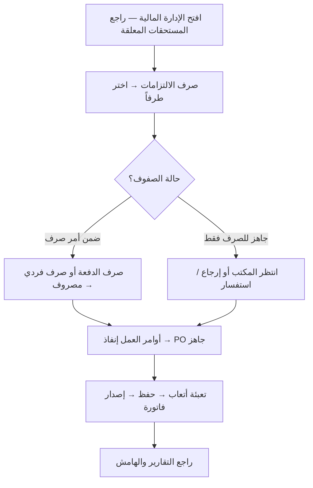

# الدورة الإجرائية لموظف المالية

> **الشاشة:** الإدارة المالية (`/financial`)  
> **الدور:** موظف مالي (`financial-officer`)  
> **مرتبط بـ:** [مسار أتعاب الأطراف والصرف](./inspector-fees-billing-workflow.md)

المالية هي **الطرف الأخير في مسار صرف الأتعاب** و**مسؤولة عن تسجيل إيراد إنفاذ**. لا تبدأ الأتعاب من عندها؛ تراجع وتنفّذ ما وصل إليها بعد اعتماد المشرف وإنشاء المكتب لأمر الصرف.

---

## نظرة عامة — محوران ماليّان

| المحور | الاتجاه | ماذا تفعل المالية |
|--------|---------|-------------------|
| **صرف الالتزامات** | صادر (تكلفة) | صرف أتعاب المعاينين والمكاتب |
| **فوترة إنفاذ** | وارد (إيراد) | تسجيل أتعاب إنفاذ وإصدار الفاتورة |

**هامش المعاملة** = إيراد إنفاذ − التزامات الأطراف المصروفة

---

## ماذا ترى عند فتح الشاشة؟

### بطاقات الملخص (أعلى الصفحة)

| البطاقة | المعنى |
|---------|--------|
| **إيرادات** | إجمالي إيرادات إنفاذ المُفوترة للفترة |
| **تكاليف خارجية** | ما صُرف أو يُستحق للمكاتب والمتعاونين |
| **هامش الربح** | الفرق بين الإيراد والتكلفة |
| **مستحقات معلقة** | أتعاب بانتظار الصرف (لم تُصرف بعد) |

### أربعة تبويبات

| التبويب | الوظيفة |
|---------|---------|
| **صرف الالتزامات (حسب الطرف)** | العمل اليومي لتنفيذ الصرف |
| **أوامر العمل الواردة (إنفاذ)** | فوترة PO لإنفاذ |
| **استعراض حسب الطرف** | قراءة فقط لعقارات كل طرف |
| **التقارير** | ملخص الإيرادات والتكاليف |

---

## المسار الكامل — من البداية حتى وصولها للمالية


| المرحلة | حالة الدفع | من ينفّذها |
|---------|------------|------------|
| إنجاز العمل | مسودة (`draft`) | مكتب / معاين |
| رفع للمراجعة | بانتظار المشرف (`sup-review`) | مكتب / معاين |
| اعتماد | جاهز للصرف (`at-finance`) | مشرف |
| طلب صرف | ضمن أمر صرف (`disb-req`) | مكتب / معاين |
| تنفيذ الصرف | مصروف (`disbursed`) | **مالية** |

**المالية تدخل فقط بعد:** اعتماد المشرف + إنشاء المكتب لأمر الصرف.

---

## التبويب 1: صرف الالتزامات (حسب الطرف)

### الخطوة 1 — فهرس الأطراف

تظهر قائمة بالأطراف (معاين، مكتب هندسي، …) الذين لديهم التزامات معلقة.

| العمود | المعنى |
|--------|--------|
| **العقارات** | عدد المعاملات المعلقة |
| **ضمن أمر صرف** | جاهزة للصرف الفعلي |
| **مُعاد/استفسار** | عادت من المالية سابقاً أو فيها استفسار |
| **المستحق (صافي)** | مجموع الأتعاب الصافية |

اضغط **دخول** على الطرف المطلوب.

### الخطوة 2 — تفاصيل الطرف

جدول بكل عقار للطرف:

| حالة الدفع | ماذا تعني | ماذا تفعل المالية؟ |
|------------|----------|---------------------|
| **جاهز للصرف (لدى المالية)** (`at-finance`) | المشرف اعتمد، المكتب لم يُنشئ أمر صرف بعد | **لا صرف** — إرجاع أو استفسار فقط |
| **ضمن أمر صرف** (`disb-req`) | المكتب أنشأ أمر صرف | **صرف** (فردي أو جماعي) |
| **مُعاد للتعديل** (`returned`) | أُعيدت من المشرف أو المالية | لا صرف — بانتظار المكتب |
| **استفسار مفتوح** (`inquiry`) | المالية طلبت توضيحاً | بانتظار رد المكتب |

### الخطوة 3 — تنفيذ الصرف

**الصرف الجماعي (الدفعة):**

1. حدّد الصفوف ذات حالة **ضمن أمر صرف** (checkbox).
2. اضغط **صرف الدفعة**.
3. تتحول الحالة إلى **مصروف** ويُسجّل سند الصرف.

**الصرف الفردي:** زر **صرف** على صف واحد بحالة `disb-req`.

> **ملاحظة:** إذا كانت كل الصفوف «جاهز للصرف» وعمود **أمر الصرف** يعرض `—`، زر الصرف معطّل — المكتب لم يُنشئ أمر الصرف بعد.

### الخطوة 4 — إجراءات بديلة (قبل الصرف)

من صف **جاهز للصرف** أو **ضمن أمر صرف**:

| الإجراء | الانتقال | متى تستخدمه |
|---------|----------|---------------|
| **إرجاع للمشرف** | `return-to-supervisor` → `returned` | خطأ في الحسم أو بيانات ناقصة |
| **استفسار للمكتب** | `inquiry-to-office` → `inquiry` | تحتاج توضيحاً قبل الصرف |

يُطلب **سبب** في نافذة قبل التأكيد.

---

## التبويب 2: أوامر العمل الواردة (إنفاذ)

مسار **الإيراد** — منفصل عن صرف الأطراف.

### متى يظهر PO؟

عندما تكتمل **كل** معاملات أمر العمل (مكتملة أو ملغاة).

### الخطوات

1. اختر **PO** من القائمة.
2. راجع كل عقار: حالة العمل، أتعاب إنفاذ، تضمين/استثناء.
3. عبّئ **أتعاب إنفاذ** لكل عقار مكتمل.
4. اضغط **حفظ** — يُسجّل في النظام.
5. اضغط **إصدار الفاتورة** — يُنشأ رقم فاتورة ويُحسب الإيراد.

### النتيجة

- يظهر في **التقارير** → إيرادات إنفاذ.
- يظهر في تبويب **المالية** على صفحة العقار → إيراد إنفاذ (وارد).
- يُحسب **هامش المعاملة** = إيراد إنفاذ − التزامات الأطراف.

---

## التبويب 3: استعراض حسب الطرف

**قراءة فقط** — لا إجراءات صرف.

- اختر طرفاً من القائمة.
- راجع عقاراته وحالات الدفع والعمل.
- افتح **سجل التدقيق** لأي انتقال سابق.

---

## التبويب 4: التقارير

| القسم | المحتوى |
|-------|---------|
| **إيرادات إنفاذ** | PO، عدد المُفوتر، المستثنيات، القيمة، رقم الفاتورة |
| **تكاليف مزودي الخدمة** | المزود، نوع العقد، التكلفة، الفئة |

للمراجعة والمتابعة — لا تنفيذ عمليات من هنا.

---

## دورة العمل اليومية لموظف المالية



---

## ما لا تفعله المالية

| الإجراء | من يفعله |
|---------|----------|
| رفع الأتعاب للمشرف | مكتب / معاين |
| اعتماد الحسم | مشرف |
| إنشاء أمر الصرف | مكتب / معاين |
| توزيع المهام وإنجاز العمل | مكتب / معاين |

---

## حالات النهاية

| الحالة | المعنى |
|--------|--------|
| **مصروف** (`disbursed`) | صُرفت أتعاب الطرف — تُحسب تكلفة خارجية |
| **فاتورة إنفاذ مُصدَرة** | سُجّل الإيراد — يظهر في التقارير والهامش |
| **مُعاد** (`returned`) | عادت للمشرف أو المكتب للمعالجة |
| **استفسار** (`inquiry`) | بانتظار رد المكتب |

---

## API ذات الصلة

| Endpoint | الوظيفة |
|----------|---------|
| `GET /api/financial/summary` | بطاقات الملخص والتقارير |
| `GET /api/inspector-fees` | قائمة الأتعاب والالتزامات |
| `POST /api/inspector-fees/{id}/transition` | صرف فردي / إرجاع / استفسار |
| `POST /api/inspector-fees/batch-transition` | صرف جماعي (دفعة) |
| `GET /api/enfaz-billing/ready-pos-summary` | أوامر العمل الجاهزة للفوترة |
| `GET/PUT /api/enfaz-billing/{poNumber}` | تعبئة أتعاب إنفاذ |
| `POST /api/enfaz-billing/{po}/issue-invoice` | إصدار فاتورة إنفاذ |

---

## دليل اختبار سريع

### التحضير

```powershell
# من جذر المشروع
npm run dev
```

سجّل دخول بحساب **موظف مالي** (`financial-officer`) وافتح **الإدارة المالية**.

### اختبار الصرف

1. تأكد أن عقارات بحالة **ضمن أمر صرف** (أنشأها المكتب من **الاتعاب والصرف → طلب صرف**).
2. **صرف الالتزامات** → اختر طرفاً → حدّد الصفوف → **صرف الدفعة**.
3. تحقق: إشعار نجاح + حالة **مصروف** + تحديث **مستحقات معلقة** في البطاقات.

### اختبار إنفاذ

1. أكمل كل معاملات PO (أو ألغِ الباقي).
2. **أوامر العمل الواردة (إنفاذ)** → اختر PO → عبّئ الأتعاب → **حفظ** → **إصدار الفاتورة**.
3. تحقق من ظهور الإيراد في **التقارير** وتبويب المالية على العقار.

### اختبار الإرجاع والاستفسار

1. من صف `at-finance` أو `disb-req` → **إرجاع للمشرف** أو **استفسار للمكتب** (مع سبب).
2. تحقق من تحديث الحالة وظهور السجل في **سجل التدقيق**.

---

## ملخص سريع

1. **الصرف لا يبدأ من المالية** — يبدأ من المكتب بـ **طلب صرف**.
2. **المالية تصرف فقط** ما حالته **ضمن أمر صرف** (`disb-req`).
3. **إنفاذ PO** مسار مستقل للإيراد بعد اكتمال المعاملات.
4. **الإرجاع والاستفسار** أدوات مراجعة قبل الصرف.
5. **التقارير والاستعراض** للمتابعة والتدقيق.
