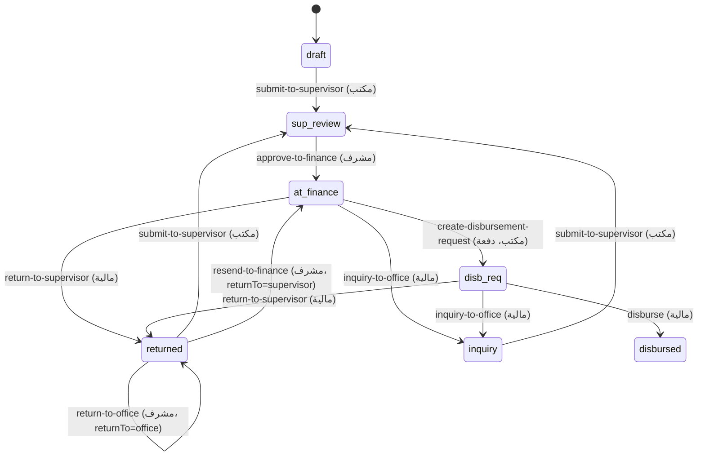

# أتعاب الأطراف — مسار الصرف

دورة حياة أتعاب **المعاينة** و**الرفع المساحي** وفق تصوّر `docs/الماليه/fees-screen-proposal.html`.

## محوران منفصلان

| المحور | القيم | المعنى |
|--------|-------|--------|
| **حالة العمل** | `in_progress` · `done` · `cancelled` | إنجاز الطرف للمهمة |
| **حالة الدفع** | `draft` → `sup-review` → `at-finance` → `disb-req` → `disbursed` | مسار الصرف المالي |

حالات إضافية: `returned` (مع `returnTo`: supervisor/office) · `inquiry`

## مسار الدفع



## الشاشات

| الدور | المسار | التبويبات / الوظيفة |
|-------|--------|---------------------|
| مكتب/معاين | `party-fees` | عقاراتي وحالاتها · أتعاب المعاملة · طلب صرف · المُعاد لي |
| مشرف | `party-fees` | الحسم والمراجعة · الأمور المالية (اعتماد/إرجاع/متابعة إنفاذ) |
| مالية | `financial` | صرف حسب الطرف · إنفاذ PO · استعراض حسب الطرف · تقارير |
| الجميع | تبويب «المالية» على العقار | صادر/وارد + هامش |

## API

| Endpoint | الوظيفة |
|----------|---------|
| `GET/PATCH /api/inspector-fees` | قائمة الأتعاب وتعديل الحسم |
| `POST /api/inspector-fees/{id}/transition` | انتقال حالة دفع |
| `POST /api/inspector-fees/batch-transition` | صرف جماعي |
| `POST /api/inspector-fees/disbursement-batch` | إنشاء أمر صرف (مكتب) |
| `GET /api/inspector-fees/{id}/transitions` | سجل التدقيق |
| `GET/PUT /api/enfaz-billing/{poNumber}` | تعبئة إيراد إنفاذ |
| `GET /api/enfaz-billing/ready-pos-summary` | أوامر العمل الجاهزة + العدد |
| `GET /api/enfaz-billing/tracking` | متابعة فوترة إنفاذ (مشرف) |
| `POST /api/enfaz-billing/{po}/issue-invoice` | إصدار فاتورة إنفاذ |

## إيراد إنفاذ

تُعبّأ من المالية لكل عقار في PO جاهز. عند الحفظ يظهر في تبويب «إيراد إنفاذ (وارد)» ويُحسب **هامش المعاملة** = إيراد إنفاذ − التزامات الأطراف.

---

## دليل الاختبار

### 1. التحضير

```powershell
# من جذر المشروع — تطبيق الهجرات
cd backend
dotnet ef database update --project RealEstateEval.Infrastructure --startup-project services/case-study/RealEstateEval.CaseStudy.Api

# تشغيل المنصة (إن لم تكن تعمل)
cd ..
npm run dev
```

تأكد أن `apps/shell/.env.local` يشير إلى API صحيح وأنك مسجّل دخول.

### 2. أدوار الاختبار

| الدور | حساب تجريبي | الشاشة |
|-------|-------------|--------|
| مكتب هندسي / معاين | engineering-office أو field-inspector | المعاملات النشطة → **الاتعاب والصرف** |
| مشرف | section-supervisor | نفس الشاشة |
| مالية | financial-officer | **الإدارة المالية** |

### 3. مسار المكتب (من الصفر إلى الصرف)

1. **توزيع مهمة** معاينة أو رفع مساحي على عقار وأكمل العمل (حالة المهمة = مكتملة).
2. افتح **الاتعاب والصرف** → تبويب **أتعاب المعاملة**.
3. تحقق: حالة الدفع = «مسودة لدى المكتب» → اضغط **رفع للمشرف**.
4. حالة الدفع → «بانتظار اعتماد المشرف».

### 4. مسار المشرف

1. سجّل كمشرف → **الاتعاب والصرف** → **الحسم والمراجعة**: طبّق **حسم** (نافذة مع سبب).
2. **الأمور المالية** → **الواردة للاعتماد** → **اعتماد ← المالية**.
3. **متابعة فوترة إنفاذ**: تحقق من ظهور PO والمعاملات (قراءة فقط).

### 5. طلب صرف (المكتب)

1. سجّل كمكتب/معاين → تبويب **طلب صرف**.
2. اختر عقارات `at-finance`، رتّب حسب التاريخ، حدّد سقف ميزانية إن أردت.
3. **إنشاء أمر صرف واعتماده** → حالة الدفع = «ضمن أمر صرف».

### 6. مسار المالية

1. **الإدارة المالية** → **صرف الالتزامات (حسب الطرف)** → ادخل لطرف.
2. حدّد صفوف `disb-req` → **صرف الدفعة** (أو صرف فردي).
3. تحقق: إشعار نجاح + حالة «مصروف» + سند صرف في عمود المستند.

### 7. إنفاذ PO

1. أكمل **كل** معاملات PO (أو ألغِ الباقي).
2. مالية → **أوامر العمل الواردة (إنفاذ)** → اختر PO (يظهر عدد مكتملة/ملغاة).
3. عبّئ أتعاب إنفاذ → **حفظ** → **إصدار الفاتورة**.
4. افتح تفاصيل العقار → تبويب **المالية** → **إيراد إنفاذ (وارد)**: يظهر الهامش.

### 8. استعراض العقارات وسجل التدقيق

1. مكتب → **عقاراتي وحالاتها** — فلاتر + بحث + ترقيم صفحات.
2. اضغط **السبب** أو **السجل** في عمود المستند → نافذة **سجل التدقيق** بكل الانتقالات.
3. مالية → **استعراض حسب الطرف** → اختر طرفاً من القائمة.

### 9. إرجاع واستفسار

1. مالية: من صف `at-finance` أو `disb-req` → **إرجاع للمشرف** أو **استفسار للمكتب** (نافذة سبب).
2. مشرف: **المُعاد من المالية** → إعادة إرسال أو إرجاع للمكتب.
3. مكتب: **المُعاد لي** → معالجة وإعادة الرفع.

### 10. ما تتحقق منه

- [ ] شارات حمراء على `party-fees` في الشريط الجانبي عند وجود إجراءات معلقة
- [ ] شريط الحالة أعلى الصفحة: مسودة/مُعاد · قيد المراجعة · مسار الصرف
- [ ] تقارير المالية تعرض رقم فاتورة إنفاذ عند الإصدار
- [ ] `GET /api/inspector-fees/{taskId}/transitions` يعيد السجل بعد كل انتقال

### 11. اختبار API مباشر (اختياري)

```powershell
# قائمة الأتعاب (استبدل TOKEN)
curl -H "Authorization: Bearer TOKEN" "http://localhost:5000/api/inspector-fees?submittedOnly=false"

# سجل التدقيق لمهمة
curl -H "Authorization: Bearer TOKEN" "http://localhost:5000/api/inspector-fees/{workflowTaskId}/transitions"
```
