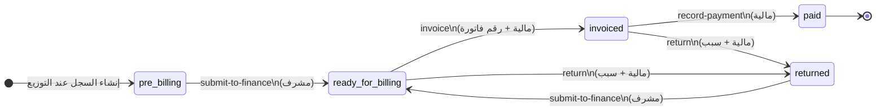
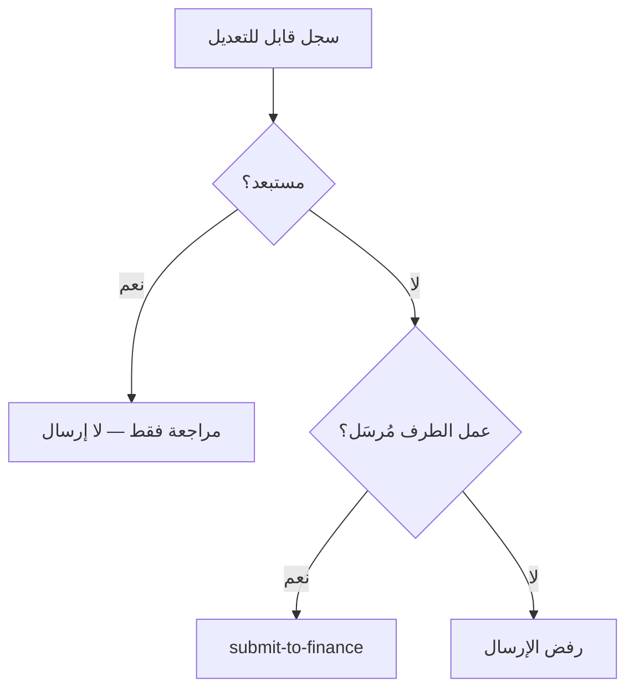

# أتعاب الأطراف — مخطط الانتقالات وصلاحيات الفوترة

مواصفة جاهزة للتنفيذ والمراجعة: دورة حياة أتعاب **المعاينة الميدانية** و**الرفع المساحي** من مراجعة المشرف حتى التحصيل المالي.

---

## 1. نطاق العمل

| البند | الوصف |
|--------|--------|
| **مصدر السجل** | صف أتعاب لكل مهمة `field-inspection` أو `engineering-survey` عند التوزيع |
| **الأطراف** | معاين ميداني، مكتب هندسي (متعاون/موظف داخلي) |
| **المشرف** | مراجعة الأتعاب والحسومات والاستبعاد، ثم الإرسال للمالية |
| **المالية** | الفوترة، التحصيل، أو الإرجاع باعتراض |
| **الطرف (معاين/مكتب)** | عرض قراءة فقط لأتعابه على شاشة **الاتعاب والفوتره** |

---

## 2. مخطط الانتقالات النهائي

### 2.1 المسار الرئيسي



### 2.2 الحالات (قيم API)

| المفتاح | التسمية العربية | معنى العمل |
|---------|-----------------|------------|
| `pre-billing` | قبل الفوترة | السجل قيد مراجعة المشرف — قابل للتعديل |
| `ready-for-billing` | جاهزة للفوترة | أُرسلت للمالية — مقفولة على المشرف |
| `invoiced` | مفوترة | صدرت فاتورة — بانتظار التحصيل |
| `paid` | مدفوعة | تم التحصيل — نهائية |
| `returned` | مُرجعة باعتراض | أعادتها المالية — المشرف يعدّل ويعيد الإرسال |

### 2.3 الإجراءات (Actions)

| الإجراء | المفتاح | من → إلى | ملاحظات |
|---------|---------|----------|---------|
| إرسال للمالية | `submit-to-finance` | `pre-billing` أو `returned` → `ready-for-billing` | يتطلب إتمام عمل الطرف؛ لا يُسمح للمستبعدين |
| فوترة | `invoice` | `ready-for-billing` → `invoiced` | **رقم الفاتورة إلزامي** |
| تحصيل | `record-payment` | `invoiced` → `paid` | — |
| إرجاع | `return` | `ready-for-billing` أو `invoiced` → `returned` | **سبب الإرجاع إلزامي**؛ يُمسح رقم الفاتورة عند الإرجاع |

### 2.4 الاستبعاد المؤقت (ليس حالة)

الاستبعاد **علم** (`ExcludedFromBatch`) وليس انتقال حالة:

- المشرف يفعّل الاستبعاد مع **سبب إلزامي**.
- السجل يبقى في `pre-billing` أو `returned`.
- **لا يمكن** `submit-to-finance` لسجل مستبعد.
- إلغاء الاستبعاد يُعيد السجل للمراجعة دون تغيير الحالة.



---

## 3. جدول الصلاحيات

### 3.1 حسب الدور (Prototype)

| الدور | الشاشة | Capability | قراءة | تعديل أتعاب | إرسال للمالية | فوترة / تحصيل / إرجاع |
|-------|--------|------------|-------|-------------|---------------|------------------------|
| **section-supervisor** | `party-fees` | `manage-operations` | كل الأتعاب | نعم (في الحالات القابلة للتعديل) | نعم | لا |
| **general-manager** / **cdo** | `party-fees` + `financial` | `manage-operations` + `manage-financial` | الكل | نعم | نعم | نعم |
| **financial-officer** | `financial` | `manage-financial` | طابور الفوترة | لا | لا | نعم |
| **field-inspector** | `party-fees` | — | أتعابه فقط | لا | لا | لا |
| **engineering-office** | `party-fees` | — | أتعابه فقط | لا | لا | لا |

### 3.2 حسب نوع العملية

| العملية | Capability | Endpoint | من يُنفّذ |
|---------|------------|----------|-----------|
| قائمة / ملخص الأتعاب | `authenticated` | `GET /api/inspector-fees` | أي مستخدم مصرّح |
| تعديل أتعاب (حسم، أتعاب موظف، استبعاد) | `manage-operations` | `PATCH /api/inspector-fees/{taskId}` | مشرف |
| إرسال للمالية (مفرد / دفعة) | `manage-operations` | `POST .../transition` · `POST .../batch-transition` | مشرف |
| فوترة | `manage-financial` | `POST .../transition` (`invoice`) | مالية |
| تحصيل | `manage-financial` | `POST .../transition` (`record-payment`) | مالية |
| إرجاع باعتراض | `manage-financial` | `POST .../transition` (`return`) | مالية |

### 3.3 قواعد التعديل (Domain)

| الحقل | متى يُعدَّل | قيود |
|-------|-------------|------|
| `AgreedFeeSar` | `pre-billing` / `returned` فقط | **موظف** (`InspectorType = موظف`) فقط |
| `SupervisorDiscountSar` | نفس الحالات | ≥ 0 |
| `DiscountReason` | مع وجود حسم | **إلزامي** إذا `SupervisorDiscountSar > 0` |
| `ExcludedFromBatch` + `ExclusionReason` | نفس الحالات | السبب إلزامي عند التفعيل |
| `BillingStatus` | — | **لا يُعدَّل مباشرة** — عبر `transition` فقط |
| `InvoiceNumber` | عند `invoice` | يُعيَّن من المالية |

---

## 4. نموذج الدومين (Domain)

### 4.1 الكيانات

```
InspectorFeeLedger          InspectorFeeTransition (سجل تدقيق)
├── WorkflowTaskId (PK)     ├── Id (PK)
├── PoNumber                ├── WorkflowTaskId
├── PropertyId / Ordinal    ├── FromStatus → ToStatus
├── AssigneeId              ├── Reason
├── InspectorType           ├── ActorUserId
├── AgreedFeeSar            └── CreatedAtUtc
├── SupervisorDiscountSar
├── DiscountReason
├── BillingStatus
├── ExcludedFromBatch
├── ExclusionReason
├── InvoiceNumber
└── CreatedAtUtc / UpdatedAtUtc
```

### 4.2 الثوابت في الكود

| الملف | المحتوى |
|-------|---------|
| `InspectorFeeBillingStatus.cs` | قيم الحالات الخمس |
| `InspectorFeeActions.cs` | مفاتيح الإجراءات الأربعة |
| `InspectorFeeBillingRules.cs` | آلة الحالات، التحقق من الحسم، تسميات عربية |
| `InspectorFeeLedger.cs` | كيان السجل |
| `InspectorFeeTransition.cs` | كيان التدقيق |

### 4.3 إنشاء السجل

يُنشأ تلقائياً عند ظهور مهمة معاينة أو رفع مساحي:

- الأتعاب الافتراضية حسب نوع الطرف (`متعاون` / `موظف`).
- الحالة الابتدائية: `pre-billing`.

---

## 5. API

### 5.1 القراءة

```
GET /api/inspector-fees
GET /api/inspector-fees/summary
GET /api/inspector-fees/{workflowTaskId}
```

**Query parameters:**

| Parameter | الاستخدام |
|-----------|-----------|
| `assigneeId` | أتعاب طرف معيّن (معاين / مكتب) |
| `workflowTaskId` | صف واحد |
| `taskKind` | `field-inspection` \| `engineering-survey` |
| `billingStatus` | تصفية طابور المالية (`ready-for-billing`, `invoiced`, …) |
| `submittedOnly` | إخفاء أعمال الطرف غير المُرسَلة (افتراضي `true` في بعض الشاشات) |

### 5.2 التعديل (مشرف)

```
PATCH /api/inspector-fees/{workflowTaskId}
```

```json
{
  "agreedFeeSar": 150,
  "supervisorDiscountSar": 20,
  "discountReason": "تأخير في التسليم",
  "excludedFromBatch": false,
  "exclusionReason": null
}
```

### 5.3 الانتقالات

```
POST /api/inspector-fees/{workflowTaskId}/transition
POST /api/inspector-fees/batch-transition
```

**مثال — إرسال للمالية:**

```json
{ "action": "submit-to-finance" }
```

**مثال — فوترة:**

```json
{ "action": "invoice", "invoiceNumber": "INV-2026-0042" }
```

**مثال — إرجاع:**

```json
{ "action": "return", "reason": "مبلغ الحسم غير موثّق" }
```

**مثال — تحصيل:**

```json
{ "action": "record-payment" }
```

كل انتقال ناجح يُسجَّل في `InspectorFeeTransitions` مع المستخدم والوقت والسبب.

---

## 6. الواجهة (Frontend)

### 6.1 شاشات وأدوار

| الشاشة | المسار / `PageId` | المكوّن | الوضع |
|--------|-------------------|---------|-------|
| الاتعاب والفوتره (طرف) | `party-fees` | `PartyFeesView` → `InspectorFeesTab` | قراءة فقط — أتعاب المستخدم |
| الاتعاب والفوتره (مشرف) | `party-fees` | نفس الشاشة + `supervisorMode` | تعديل، استبعاد، إرسال فردي/دفعة |
| التقارير المالية | `financial` | `FinanceBillingQueue` | فوترة، تحصيل، إرجاع |

### 6.2 شريط المؤشرات (KPI) — `party-fees`

| البطاقة | المعنى |
|---------|--------|
| إجمالي العقارات | عدد صفوف الأتعاب |
| قبل الفوترة | `pre-billing` + `returned` |
| جاهزة للفوترة | `ready-for-billing` |
| مفوترة / مدفوعة | `invoiced` + `paid` |

### 6.3 ملخص المبالغ (API Summary)

| الحقل | المحتوى |
|-------|---------|
| `netPreBillingSar` | صافي قبل الفوترة + المُرجَع |
| `readyForBillingSar` | صافي الجاهز للفوترة |
| `invoicedSar` | صافي المفوتر |
| `paidSar` | صافي المدفوع |
| `totalDiscountsSar` | إجمالي حسومات المشرف |

---

## 7. خريطة الملفات المنفّذة

| طبقة | الملف |
|------|-------|
| Domain | `backend/RealEstateEval.Domain/InspectorFee*.cs` |
| Rules | `backend/RealEstateEval.Application/Rules/InspectorFeeBillingRules.cs` |
| DTOs | `backend/RealEstateEval.Application/Contracts/InspectorFeeDtos.cs` |
| Service | `backend/RealEstateEval.Infrastructure/Services/InspectorFeeService.cs` |
| API | `backend/services/case-study/.../InspectorFeesController.cs` |
| Migration | `.../Migrations/20260623140000_AddInspectorFeeBillingWorkflow.cs` |
| Permissions | `PlatformPermissionCatalog.cs` · `packages/app-shared/.../constants.ts` |
| API Client | `packages/api-client/src/inspector-fees.ts` |
| Shared API | `packages/app-shared/src/prototype/inspector-fees-api.ts` |
| جدول المشرف | `apps/mfe-case-study/.../InspectorFeesBillingTable.tsx` |
| شاشة الأطراف | `apps/mfe-case-study/.../PartyFeesView.tsx` |
| طابور المالية | `apps/mfe-financial/.../FinanceBillingQueue.tsx` |

---

## 8. تسلسل العمل الموصى به (UAT)

1. **توزيع** مهمة معاينة/رفع مساحي → يظهر سجل أتعاب `pre-billing`.
2. **الطرف** ينجز العمل ويُرسِله → يصبح السجل مؤهّلاً للإرسال للمالية.
3. **المشرف** يفتح `party-fees` → يعدّل حسمًا (مع سبب) أو يستبعد عقارًا مؤقتًا.
4. **المشرف** يضغط **إرسال للمالية** → `ready-for-billing`.
5. **المالية** في `financial` → **فوترة** برقم فاتورة → `invoiced`.
6. **المالية** → **تحصيل** → `paid`.
7. عند الخطأ: **إرجاع** مع سبب → `returned` → المشرف يصحّح ويعيد الإرسال.

---

## 9. ملاحظات مستقبلية (خارج النطاق الحالي)

- ربط إيرادات إنفاذ (PO) بصفوف الأتعاب في تقرير `FinancialReportService`.
- واجهة عرض سجل التدقيق `InspectorFeeTransitions` لكل عقار.
- إشعارات للطرف عند الفوترة أو الإرجاع.
- استبدال `window.prompt` في واجهة المالية بنماذج حوار من التصميم الموحّد.
