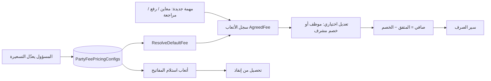

# منطق التسعيرة

> مرجع تشغيلي/هندسي لجدول أسعار الأتعاب الافتراضية (**التسعيرة**).  
> للمسار المالي الكامل راجع [نموذج المالية المتفق عليه](./نموذج-المالية-المتفق-عليه.md) و[مسار أتعاب الأطراف](../inspector-fees-billing-workflow.md).

## 1) الفكرة الأساسية

**التسعيرة** = جدول أسعار افتراضي واحد (صف singleton في قاعدة البيانات) يعدّله **مسؤول النظام** من الإعدادات.

عند إنشاء سجل أتعاب لمهمة مؤهّلة، النظام **يختم** السعر الافتراضي على السجل (`AgreedFeeSar`). بعد الختم يعيش المبلغ على السجل مستقلاً — **تغيير الجدول لا يعدّل الأتعاب القديمة**.



## 2) ما يشمله / ما لا يشمله

| المفهوم | جزء من التسعيرة؟ | ملاحظات |
|---------|------------------|---------|
| أتعاب المكتب الهندسي — رفع مساحي (افتراضي) | نعم | شرائح حسب مساحة العقار؛ يُختم عند إنشاء سجل الأتعاب |
| أتعاب المراجع الحكومي — فرد (افتراضي) | نعم | سعر ثابت |
| أتعاب المعاين حسب النوع (فرد / منشأة) | نعم | سعر ثابت لكل نوع |
| أتعاب استلام المفاتيح | نعم | عند إنشاء ظرف مفاتيح |
| فوترة إنفاذ PO (`CaseStudyFeeSar` + `SurveyFeeSar` + VAT 15%) | **لا** | إدخال يدوي من المالية |
| سعر التقييم عند المقيّم | **لا** | قيمة تقييم العقار، ليست أتعاب أطراف |

## 3) حقول الجدول

### أ) المكتب الهندسي — شرائح المساحة (الرفع المساحي)

**المهمة:** `engineering-survey` — نوع الطرف يُفرض «متعاون شركة».

السعر الافتراضي يُحسب من **مساحة العقار** (م²) عبر شرائح قابلة للتعديل من الإعدادات:

| المساحة (م²) | الحقل في الـ API / DB | السعر الافتراضي (بذرة) ر.س |
|--------------|----------------------|---------------------------|
| 1 – 500 | `EngineeringSurveyAreaTier1FeeSar` | 300 |
| 501 – 1,000 | `EngineeringSurveyAreaTier2FeeSar` | 450 |
| 1,001 – 1,500 | `EngineeringSurveyAreaTier3FeeSar` | 900 |
| 1,501 – 10,000 | `EngineeringSurveyAreaTier4FeeSar` | 1,500 |
| أكثر من 10,000 | `EngineeringSurveyAreaTier5FeeSar` | 4,000 |

```text
ResolveEngineeringSurveyFee(areaM2):
  if areaM2 <= 500        → Tier1
  if areaM2 <= 1000       → Tier2
  if areaM2 <= 1500       → Tier3
  if areaM2 <= 10000      → Tier4
  else                    → Tier5
```

> مصدر المساحة: بيانات العقار في الدراسة عند إنشاء سجل الأتعاب. إذا غابت المساحة، يُستخدم الحد الأدنى (الشريحة 1) أو يُعلَّق الختم حتى توفرها — حسب تنفيذ الخدمة.

### ب) باقي البنود — أسعار ثابتة

| الحقل في الواجهة | الحقل في الـ API / DB | الاستخدام | البذرة ر.س |
|------------------|----------------------|-----------|------------|
| مراجع حكومي — فرد | `GovernmentReviewFeeSar` | مهمة `government-review` | 350 |
| استلام مفاتيح | `KeyReceiptFeeSar` | ظرف المفاتيح | 350 |
| معاين — فرد | `FieldInspectorIndividualFeeSar` | معاينة + «متعاون فرد» | 400 |
| معاين — منشأة | `FieldInspectorOrganizationFeeSar` | معاينة + «متعاون شركة» | 500 |

> البذور للافتراضي الأول فقط. المعدّل الحي يأتي من قاعدة البيانات بعد الحفظ.

## 4) كيف يُختار السعر الافتراضي؟

المصدر: `PartyFeePricingService.ResolveFromDto`

| نوع المهمة (`taskKind`) | السعر المستخدم |
|-------------------------|----------------|
| `engineering-survey` | شريحة مساحة العقار (انظر §3أ) — نوع الطرف يُفرض «متعاون شركة» |
| `government-review` | `GovernmentReviewFeeSar` — مراجع حكومي فرد (نوع الطرف يُفرض «متعاون فرد») |
| `field-inspection` | حسب نوع الطرف (انظر أدناه) |

### نوع طرف المعاينة (`partyType`)

| النوع | السعر |
|--------|--------|
| متعاون شركة | منشأة |
| متعاون فرد / متعاون (قديم) | فرد |
| غير ذلك (موظف) | **ليس ضمن التسعيرة** — يُعالَج خارج جدول الأسعار الافتراضية |

يُستنتج النوع من ملف المستخدم / العقد عند التوفر؛ وإلا منطق تراثي (`fi-ahmed` → متعاون فرد، وإلا موظف).

### صيغة الصافي عند الصرف

```text
NetFee = max(0, AgreedFeeSar − max(0, SupervisorDiscountSar))
```

- الخصم > 0 يتطلب سببًا.
- الواجهة تقيّد الخصم ≤ المبلغ المتفق.

### قواعد التعديل على السجل

| الإجراء | من يستطيع |
|---------|-----------|
| تعديل `AgreedFeeSar` على السجل | **موظف فقط** (والحالة قابلة للتعديل) |
| خصم المشرف | مسار المشرف على أتعاب الأطراف |
| المتعاون | المبلغ من التسعيرة؛ التغيير عبر الخصم أو جدول جديد للمهام **القادمة** فقط |

## 5) المسار من الضبط إلى التطبيق

1. **الضبط:** الإعدادات → التسعيرة → حفظ  
   `PUT /api/financial/v1/party-fee-pricing`  
   القيم تُقيَّد `≥ 0`.
2. **تطبيق أتعاب الأطراف:** عند وجود مهام مؤهّلة، `InspectorFeeService.EnsureLedgersForTasksAsync` يستدعي `ResolveDefaultFeeAsync` ويكتب `AgreedFeeSar` مرة واحدة.
3. **تطبيق المفاتيح:** إنشاء ظرف مفاتيح يستدعي حل سعر استلام المفاتيح من الجدول.
4. **العرض والصرف:** شاشات أتعاب الأطراف / المالية تعرض المتفق والخصم والصافي وتنقل الحالات حتى الصرف.

### استلام المفاتيح — احتياطي

إذا `KeyReceiptFeeSar == 0` يُعرض/يُستخدم `GovernmentReviewFeeSar` كاحتياطي (في الـ DTO وخدمة المفاتيح).

## 6) الصلاحيات

| الإجراء | من |
|---------|-----|
| رؤية صفحة الإعدادات → التسعيرة | مسؤول النظام فقط (صفحة `fee-pricing`) |
| تعديل الجدول (`PUT`) | صلاحية `manage-system-config` |
| قراءة الجدول (`GET`) | أي مستخدم مسجّل (الواجهة مقيدة للمسؤول) |
| شاشات أتعاب الأطراف | معاين / مكتب هندسي / مراجع حكومي / مشرف (+ عمليات) |
| صرف / فوترة إنفاذ | ضابط مالية / `manage-financial` |

> نُقلت التسعيرة من تبويب المالية إلى إعدادات المسؤول (صلاحية النظام بدل صلاحية المالية).

## 7) الملفات المرجعية

### واجهة

| المسار | الدور |
|--------|--------|
| `apps/shell/src/components/views/FeePricingView.tsx` | صفحة الإعدادات |
| `apps/mfe-financial/src/components/FinancePartyFeePricing.tsx` | نموذج التسعيرة (شرائح المكتب الهندسي + 4 أسعار ثابتة) |
| `packages/app-shared/src/prototype/settings-nav.ts` | عنصر القائمة «التسعيرة» |
| `apps/mfe-case-study/src/views/PartyFeesView.tsx` | مساحة أتعاب الأطراف |
| `apps/mfe-case-study/src/components/field-inspection/InspectorFeesBillingTable.tsx` | جدول الأتعاب |
| `packages/app-shared/src/fees/FeeDiscountModal.tsx` | خصم المشرف |
| `apps/mfe-financial/src/components/FinanceEnfazPoBilling.tsx` | إيراد إنفاذ (منفصل) |

### API / خدمات / قواعد

| المسار | الدور |
|--------|--------|
| `Financial.Api` → `GET/PUT .../party-fee-pricing` | قراءة/حفظ الجدول |
| `packages/api-client/src/financial.ts` | عميل التسعيرة |
| `backend/.../PartyFeePricingService.cs` | Get / Save / ResolveDefaultFee |
| `backend/.../InspectorFeeService.cs` | إنشاء السجلات وسير الصرف |
| `backend/.../KeyEnvelopesService.cs` | ختم أتعاب المفاتيح |
| `backend/.../PoEnfazBillingService.cs` | إيراد إنفاذ + VAT |
| `backend/.../Rules/InspectorFeeRules.cs` | أنواع الأطراف وصيغة الصافي |
| `backend/.../Domain/PartyFeePricingConfig.cs` | كيان الجدول |
| `backend/.../Domain/InspectorFeeLedger.cs` | سجل الأتعاب المطبق |

### قاعدة البيانات

| الجدول | المحتوى |
|--------|---------|
| `financial."PartyFeePricingConfigs"` | جدول التسعيرة (singleton) |
| `case_study."InspectorFeeLedgers"` | الأتعاب المطبّقة |
| `financial."KeyReceiptFeeCharges"` | رسوم استلام المفاتيح |

## 8) إيراد إنفاذ (منفصل عن التسعيرة)

```text
LineTotal = CaseStudyFeeSar + SurveyFeeSar
Subtotal  = Σ بنود العقارات المشمولة
VAT       = round(Subtotal × 0.15, 2)
Total     = Subtotal + VAT
```

لا يوجد ربط بـ `PartyFeePricingConfigs`.

## 9) ملاحظات وفجوات معروفة

### أ) ملاحظات عامة

1. **تغيير التسعيرة غير رجعي** — السجلات القائمة تحتفظ بالمبلغ المختوم سابقًا.
2. **تعديل المبلغ المتفق للموظف فقط** — بعض الوثائق تذكر أن كل `AgreedFeeSar` قابل للتعديل؛ الكود أضيق.
3. **`fi-ahmed` ثابت** كمتعاون فرد عند غياب البروفايل (منطق تراثي).
4. **مفاتيح بسعر 0** → احتياطي سعر المراجع الحكومي — فرد.
5. **شرائح المكتب الهندسي** — حدود الشرائح (500 / 1,000 / 1,500 / 10,000 م²) ثابتة في الكود؛ المسؤول يعدّل **الأسعار** فقط من الإعدادات.
6. **إيراد إنفاذ بدون جدول إداري** — دائمًا يدوي من المالية؛ لا ربط بـ `PartyFeePricingConfigs`.
7. **سعر التقييم ≠ أتعاب** — مفهومان ماليان مختلفان؛ لا تخلط بينهما في المراجعات.
8. **`FieldInspectorEmployeeFeeSar` ملغى من التسعيرة** — الحقل القديم قد يبقى في الـ API مؤقتًا لكنه خارج المنطق الجديد.

### ب) قرارات التنفيذ الإلزامية (قبل البرمجة)

> هذه القرارات تُغلق الفجوات التي قد تُنتج ختمًا خاطئًا أو سجلات بلا مبلغ. التنفيذ يبقى **داخل البنية الحالية** (DB + Service + Rules + UI) بعد اعتمادها.

#### قرار 1 — غياب المساحة عند ختم أتعاب المكتب الهندسي

| الخيار | السلوك | الاعتماد |
|--------|--------|----------|
| **أ) تأجيل الختم** *(مُوصى به)* | لا يُكتب `AgreedFeeSar` لمهمة `engineering-survey` حتى تتوفر مساحة العقار (> 0) في الدراسة | **معتمد** |
| ب) الشريحة 1 افتراضيًا | ختم فوري بسعر الشريحة 1 | مرفوض — خطر ختم منخفض لعقارات كبيرة |
| ج) إعادة ختم عند أول إدخال مساحة | تحديث `AgreedFeeSar` مرة واحدة قبل مغادرة حالة «مسودة» | احتياطي إذا تعذّر تأجيل الإنشاء |

**التنفيذ:** `InspectorFeeService.EnsureLedgersForTasksAsync` يتخطى الختم أو يُنشئ السجل بـ `AgreedFeeSar = null` حتى توفر المساحة؛ عند الإدخال يستدعي `ResolveEngineeringSurveyFee`.

#### قرار 2 — معاين الموظف خارج جدول التسعيرة

| السلوك | التفاصيل |
|--------|----------|
| **لا سعر افتراضي من التسعيرة** | عند `partyType = موظف` لا يُستدعى `FieldInspectorEmployeeFeeSar` |
| **إلزام إدخال يدوي** | موظف النظام يدخل `AgreedFeeSar` قبل إكمال سير الصرف |
| **منع التقدّم** | السجل يبقى في حالة قابلة للتعديل حتى يُدخل مبلغ > 0 |

**التنفيذ:** تعديل `InspectorFeeRules` + تحقق في `InspectorFeeService`؛ إزالة حقل الموظف من `FinancePartyFeePricing`.

#### قرار 3 — مصدر المساحة عند تعدد العقارات

| السلوك | التفاصيل |
|--------|----------|
| **مساحة العقار المرتبط بالمهمة** | إن وُجد ربط مباشر task → property، تُستخدم مساحة ذلك العقار |
| **احتياطي: العقار الوحيد في الدراسة** | إن كانت الدراسة تحتوي عقارًا واحدًا فقط |
| **احتياطي ثانٍ: أكبر مساحة** | إن تعددت العقارات بلا ربط واضح — تُستخدم **أكبر** مساحة في الدراسة (الأكثر تحفّظًا للتسعير) |

**التنفيذ:** تمرير `areaM2` صريحًا إلى `ResolveDefaultFeeAsync` من سياق المهمة/العقار.

### ج) تعارضات التنفيذ — المعالجة في المكان أم لا؟

| # | التعارض | الخطورة | المعالجة في المكان؟ | الإجراء |
|---|---------|---------|---------------------|---------|
| 1 | `EngineeringSurveyFeeSar` ثابت ← 5 شرائح | حرجة | **نعم** | Migration + `PartyFeePricingService` + UI |
| 2 | `ResolveDefaultFee` بلا مساحة | حرجة | **نعم — بعد قرار 1** | تمرير `areaM2` من الدراسة |
| 3 | إلغاء تسعيرة معاين الموظف | حرجة | **نعم — بعد قرار 2** | قواعد + تحقق إلزامي |
| 4 | تغيّر المساحة بعد الختم | عالية | **نعم — بشرط** | تعديل يدوي `AgreedFeeSar` (موظف) أو خصم مشرف؛ تنبيه واجهة اختياري |
| 5 | فوترة إنفاذ `SurveyFeeSar` منفصلة عن شرائح الأطراف | عالية | **لا — خارج النطاق** | سياسة تشغيل؛ ربط لاحق اختياري |
| 6 | حدود الشرائح غير قابلة للتعديل من الإعدادات | متوسطة | **نعم** إذا قبلت الحدود الثابتة؛ **لا** إذا طُلبت ديناميكية | جدول شرائح في DB (توسيع لاحق) |
| 7 | عقد API / واجهة (6 حقول ← شرائح + 4) | متوسطة | **نعم** | DTO + `financial.ts` + حقول قديمة nullable مؤقتًا |
| 8 | سجلات مختومة بـ 500 ر.س تاريخيًا | متوسطة | **لا — مقصود** | لا ترحيل؛ المهام الجديدة فقط بالمنطق الجديد |
| 9 | توقيت إدخال المساحة في دورة الحياة | متوسطة | **نعم — بعد قرار 3** | ربط المهمة بالعقار |
| 10 | `fi-ahmed` / تصنيف موظف | متوسطة | **نعم** | يُغطى بقرار 2 |

**ما لا يتعارض (يمشي كما هو):** مراجع حكومي فرد، معاين فرد/منشأة، استلام مفاتيح، صيغة الصافي، الصلاحيات، مسار الصرف، سعر التقييم.

### د) ترتيب التنفيذ المقترح

1. اعتماد قرارات §9ب (1–3).
2. Migration: أعمدة الشرائح الخمس + بذور القيم؛ إهمال `EngineeringSurveyFeeSar`.
3. `PartyFeePricingService.ResolveEngineeringSurveyFee(areaM2)`.
4. `InspectorFeeService`: تأجيل الختم + تمرير المساحة.
5. `InspectorFeeRules`: إزالة مسار تسعيرة الموظف + تحقق الإدخال اليدوي.
6. `FinancePartyFeePricing` + API client + اختبارات تكامل.

## 10) خلاصة للمراجعة

جدول تسعيرة واحد يملكه المسؤول يحدد **الافتراضات** لأتعاب الأطراف واستلام المفاتيح: **شرائح مساحة للمكتب الهندسي**، و**أسعار ثابتة** لمراجع حكومي فرد والمعاين (فرد/منشأة) والمفاتيح. المبالغ الحية بعد الإنشاء تعيش على السجلات ويمكن أن تختلف عن الجدول الحالي. فوترة إنفاذ وسعر التقييم مساران ماليان موازيان وليسا جزءًا من التسعيرة.
