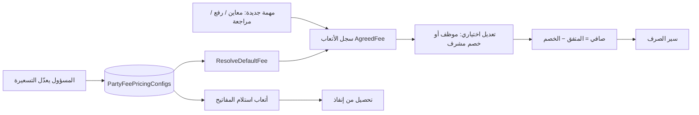

# منطق التسعيرة

> مرجع تشغيلي/هندسي لجدول أسعار الأتعاب الافتراضية (**التسعيرة**).  
> للمسار المالي الكامل راجع [نموذج المالية المتفق عليه](./نموذج-المالية-المتفق-عليه.md) و[مسار أتعاب الأطراف](../inspector-fees-billing-workflow.md).

## 1) الفكرة الأساسية

**التسعيرة** = جدول أسعار افتراضي واحد (صف singleton في قاعدة البيانات) يعدّله **مسؤول النظام** من الإعدادات.

عند إنشاء سجل أتعاب لمهمة مؤهّلة، النظام **يختم** السعر الافتراضي على السجل (`AgreedFeeSar`). بعد الختم يعيش المبلغ على السجل مستقلاً — **تغيير الجدول لا يعدّل الأتعاب القديمة**.



## 2) ما يشمله / ما لا يشمله

| المفهوم | جزء من التسعيرة؟ | ملاحظات |
|---------|------------------|---------|
| أتعاب الرفع المساحي (افتراضي) | نعم | يُختم عند إنشاء سجل الأتعاب |
| أتعاب المراجعة الحكومية (افتراضي) | نعم | |
| أتعاب المعاين حسب النوع (فرد / منشأة / موظف) | نعم | |
| أتعاب استلام المفاتيح | نعم | عند إنشاء ظرف مفاتيح |
| فوترة إنفاذ PO (`CaseStudyFeeSar` + `SurveyFeeSar` + VAT 15%) | **لا** | إدخال يدوي من المالية |
| سعر التقييم عند المقيّم | **لا** | قيمة تقييم العقار، ليست أتعاب أطراف |

## 3) حقول الجدول (6 أسعار)

| الحقل في الواجهة | الحقل في الـ API / DB | الاستخدام |
|------------------|----------------------|-----------|
| أتعاب الرفع المساحي | `EngineeringSurveyFeeSar` | مهمة `engineering-survey` |
| أتعاب المراجعة الحكومية | `GovernmentReviewFeeSar` | مهمة `government-review` |
| أتعاب استلام المفاتيح | `KeyReceiptFeeSar` | ظرف المفاتيح |
| معاين — فرد | `FieldInspectorIndividualFeeSar` | معاينة + «متعاون فرد» |
| معاين — منشأة | `FieldInspectorOrganizationFeeSar` | معاينة + «متعاون شركة» |
| معاين — موظف | `FieldInspectorEmployeeFeeSar` | معاينة + «موظف» |

### قيم البذرة (عند أول إنشاء للصف فقط)

| البند | ر.س |
|--------|-----|
| رفع مساحي | 500 |
| مراجعة حكومية | 350 |
| استلام مفاتيح (بذرة) | 350 |
| معاين فرد | 400 |
| معاين منشأة | 500 |
| معاين موظف | 100 |

> البذور للافتراضي الأول فقط. المعدّل الحي يأتي من قاعدة البيانات بعد الحفظ.

## 4) كيف يُختار السعر الافتراضي؟

المصدر: `PartyFeePricingService.ResolveFromDto`

| نوع المهمة (`taskKind`) | السعر المستخدم |
|-------------------------|----------------|
| `engineering-survey` | `EngineeringSurveyFeeSar` (نوع الطرف يُفرض «متعاون شركة») |
| `government-review` | `GovernmentReviewFeeSar` (نوع الطرف يُفرض «متعاون فرد») |
| `field-inspection` | حسب نوع الطرف (انظر أدناه) |

### نوع طرف المعاينة (`partyType`)

| النوع | السعر |
|--------|--------|
| متعاون شركة | منشأة |
| متعاون فرد / متعاون (قديم) | فرد |
| غير ذلك (موظف) | موظف |

يُستنتج النوع من ملف المستخدم / العقد عند التوفر؛ وإلا منطق تراثي (`fi-ahmed` → متعاون فرد، وإلا موظف).

### صيغة الصافي عند الصرف

```text
NetFee = max(0, AgreedFeeSar − max(0, SupervisorDiscountSar))
```

- الخصم > 0 يتطلب سببًا.
- الواجهة تقيّد الخصم ≤ المبلغ المتفق.

### قواعد التعديل على السجل

| الإجراء | من يستطيع |
|---------|-----------|
| تعديل `AgreedFeeSar` على السجل | **موظف فقط** (والحالة قابلة للتعديل) |
| خصم المشرف | مسار المشرف على أتعاب الأطراف |
| المتعاون | المبلغ من التسعيرة؛ التغيير عبر الخصم أو جدول جديد للمهام **القادمة** فقط |

## 5) المسار من الضبط إلى التطبيق

1. **الضبط:** الإعدادات → التسعيرة → حفظ  
   `PUT /api/financial/v1/party-fee-pricing`  
   القيم تُقيَّد `≥ 0`.
2. **تطبيق أتعاب الأطراف:** عند وجود مهام مؤهّلة، `InspectorFeeService.EnsureLedgersForTasksAsync` يستدعي `ResolveDefaultFeeAsync` ويكتب `AgreedFeeSar` مرة واحدة.
3. **تطبيق المفاتيح:** إنشاء ظرف مفاتيح يستدعي حل سعر استلام المفاتيح من الجدول.
4. **العرض والصرف:** شاشات أتعاب الأطراف / المالية تعرض المتفق والخصم والصافي وتنقل الحالات حتى الصرف.

### استلام المفاتيح — احتياطي

إذا `KeyReceiptFeeSar == 0` يُعرض/يُستخدم `GovernmentReviewFeeSar` كاحتياطي (في الـ DTO وخدمة المفاتيح).

## 6) الصلاحيات

| الإجراء | من |
|---------|-----|
| رؤية صفحة الإعدادات → التسعيرة | مسؤول النظام فقط (صفحة `fee-pricing`) |
| تعديل الجدول (`PUT`) | صلاحية `manage-system-config` |
| قراءة الجدول (`GET`) | أي مستخدم مسجّل (الواجهة مقيدة للمسؤول) |
| شاشات أتعاب الأطراف | معاين / مكتب هندسي / مراجع حكومي / مشرف (+ عمليات) |
| صرف / فوترة إنفاذ | ضابط مالية / `manage-financial` |

> نُقلت التسعيرة من تبويب المالية إلى إعدادات المسؤول (صلاحية النظام بدل صلاحية المالية).

## 7) الملفات المرجعية

### واجهة

| المسار | الدور |
|--------|--------|
| `apps/shell/src/components/views/FeePricingView.tsx` | صفحة الإعدادات |
| `apps/mfe-financial/src/components/FinancePartyFeePricing.tsx` | نموذج الـ 6 أسعار |
| `packages/app-shared/src/prototype/settings-nav.ts` | عنصر القائمة «التسعيرة» |
| `apps/mfe-case-study/src/views/PartyFeesView.tsx` | مساحة أتعاب الأطراف |
| `apps/mfe-case-study/src/components/field-inspection/InspectorFeesBillingTable.tsx` | جدول الأتعاب |
| `packages/app-shared/src/fees/FeeDiscountModal.tsx` | خصم المشرف |
| `apps/mfe-financial/src/components/FinanceEnfazPoBilling.tsx` | إيراد إنفاذ (منفصل) |

### API / خدمات / قواعد

| المسار | الدور |
|--------|--------|
| `Financial.Api` → `GET/PUT .../party-fee-pricing` | قراءة/حفظ الجدول |
| `packages/api-client/src/financial.ts` | عميل التسعيرة |
| `backend/.../PartyFeePricingService.cs` | Get / Save / ResolveDefaultFee |
| `backend/.../InspectorFeeService.cs` | إنشاء السجلات وسير الصرف |
| `backend/.../KeyEnvelopesService.cs` | ختم أتعاب المفاتيح |
| `backend/.../PoEnfazBillingService.cs` | إيراد إنفاذ + VAT |
| `backend/.../Rules/InspectorFeeRules.cs` | أنواع الأطراف وصيغة الصافي |
| `backend/.../Domain/PartyFeePricingConfig.cs` | كيان الجدول |
| `backend/.../Domain/InspectorFeeLedger.cs` | سجل الأتعاب المطبق |

### قاعدة البيانات

| الجدول | المحتوى |
|--------|---------|
| `financial."PartyFeePricingConfigs"` | جدول التسعيرة (singleton) |
| `case_study."InspectorFeeLedgers"` | الأتعاب المطبّقة |
| `financial."KeyReceiptFeeCharges"` | رسوم استلام المفاتيح |

## 8) إيراد إنفاذ (منفصل عن التسعيرة)

```text
LineTotal = CaseStudyFeeSar + SurveyFeeSar
Subtotal  = Σ بنود العقارات المشمولة
VAT       = round(Subtotal × 0.15, 2)
Total     = Subtotal + VAT
```

لا يوجد ربط بـ `PartyFeePricingConfigs`.

## 9) ملاحظات وفجوات معروفة

1. **تغيير التسعيرة غير رجعي** — السجلات القائمة تحتفظ بالمبلغ المختوم سابقًا.
2. **تعديل المبلغ المتفق للموظف فقط** — بعض الوثائق تذكر أن كل `AgreedFeeSar` قابل للتعديل؛ الكود أضيق.
3. **`fi-ahmed` ثابت** كمتعاون فرد عند غياب البروفايل (منطق تراثي).
4. **مفاتيح بسعر 0** → احتياطي سعر المراجعة الحكومية.
5. **إيراد إنفاذ بدون جدول إداري** — دائمًا يدوي من المالية.
6. **سعر التقييم ≠ أتعاب** — مفهومان ماليان مختلفان؛ لا تخلط بينهما في المراجعات.

## 10) خلاصة للمراجعة

جدول تسعيرة واحد يملكه المسؤول يحدد **الافتراضات** لأتعاب الأطراف واستلام المفاتيح. المبالغ الحية بعد الإنشاء تعيش على السجلات ويمكن أن تختلف عن الجدول الحالي. فوترة إنفاذ وسعر التقييم مساران ماليان موازيان وليسا جزءًا من التسعيرة.
