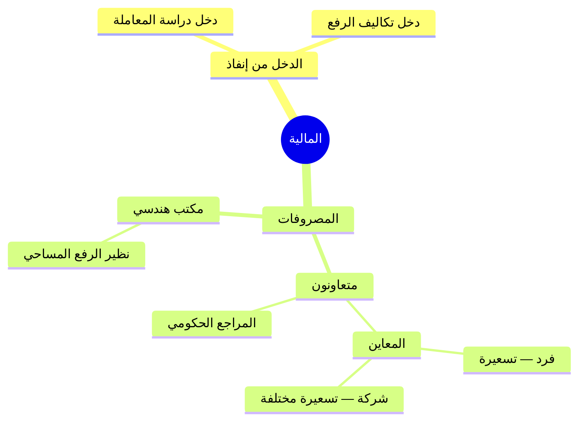

# نموذج المالية المتفق عليه

> مرجع الاتفاق التشغيلي. للتفاصيل المطبّقة حالياً راجع [دورة موظف المالية](../finance-officer-workflow.md) و[مسار أتعاب الأطراف](../inspector-fees-billing-workflow.md).

## المخطط الذهني



## 1) الدخل (وارد من إنفاذ)

| البند | الوصف |
|--------|--------|
| دخل على إجمالي دراسة المعاملة | `CaseStudyFeeSar` |
| دخل لتكاليف الرفع | `SurveyFeeSar` |

**المطبّق:** بندَان لكل عقار + مجموع للفاتورة وVAT 15٪. الحفظ يقبل أيضاً المبلغ القديم القديم للتوافق.

## 2) المصروفات (صادر)

| البند | التسعيرة الافتراضية |
|--------|---------------------|
| مكتب هندسي (جهة خارجية — رفع مساحي منتهٍ) | قابل للتعديل (بذرة 500) |
| المعاين — متعاون فرد | قابل للتعديل (بذرة 400) |
| المعاين — متعاون شركة | قابل للتعديل (بذرة 500) |
| المعاين — موظف | قابل للتعديل (بذرة 100) |
| المراجع الحكومي — متعاون فرد فقط | قابل للتعديل (بذرة 350) |

**المطبّق:** سجلات أتعاب بعد اكتمال دراسة الحالة للصك. الجدول الافتراضي في `financial.PartyFeePricingConfigs` عبر `GET/PUT /api/financial/v1/party-fee-pricing`. كل سجل `AgreedFeeSar` قابل للتعديل بعد الإنشاء. المكتب الهندسي دائماً جهة خارجية. المراجع الحكومي «متعاون فرد» فقط.

## 3) مسار الصرف المطبق (أتعاب المعاينة والرفع والمراجعة)

```
مسودة → بانتظار المشرف → جاهز لدى المالية → أمر صرف → مصروف
         ↕ إرجاع / استفسار
```

## ملف PDF

يُولَّد عبر:

```bash
python docs/الماليه/generate_finance_model_pdf.py
```

المخرجات: `docs/الماليه/نموذج-المالية-المتفق-عليه.pdf`

